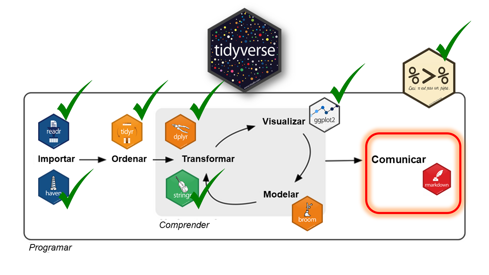

# **ENCUENTROS DEL 24 AL 28/2 15 A 18 HS**

## Encuentro 1: Presentación del taller. Introducción a las Ciencias Sociales Computacionales y a R. Qué son las CSS y R. Qué es (muy brevemente) la EPH.
## Encuentro 2: Qué es RBase yRStudio. Operaciones básicas y objetos 
## Encuentro 3: Manipulación, transformación y procesamiento de datos. Mundo Tidyverse.
## Encuentro 4: Visualización de datos en R. Mundo Ggplot2.
## Encuentro 5: Producción de informes y automatización de reportes. Mundo RMarkdown.


---


# **Ciencias Sociales Computacionales**

## *Nuevas herramientas/polémicas para el análisis social*

¿Para qué y por qué pensar la relación entre métodos computacionales y Ciencias Sociales? ¿Cómo nos interpela como cientistas sociales?¿Cuáles son las implicancias para los procesos de investigación? ¿Cambian los instrumentos y cambia toda la teoría social que va con ellos? ¿Qué repercusiones trae el giro computacional para el pensamiento social? ¿Qué aperturas debemos
pensar en nuestras carreras de grado y posgrado (contenidos, lenguajes, habilidades) para ser
capaces de abordar desafíos de conocimiento transdisciplinares para ampliar la imaginación
social? ¿Qué aprendizajes podemos construir como comunidad académica-educativa?  ¿Cuáles
son las habilidades técnicas e intelectuales que necesitamos dominar? ¿Qué significa ser un/a
académico/a en la era digital? ¿Quién puede leer y escribir “los números”? ¿Cómo es posible formarnos para que nos sintamos igualmente cómodos/as con los algoritmos y el análisis de datos, así como con el análisis social y la teoría? 


---

## **¿Qué son las Ciencias Sociales Computacionales?**

- 🔍 Intersección entre las ciencias sociales, la informática y la estadística.
- 📊 Uso de datos masivos y algoritmos para analizar fenómenos sociales.
- 🌍 Aplicaciones en sociología, economía, ciencia política y más.
- 🔍 Auge de tecnicas de Machine Learning y minería de datos para análisis a gran escala y tiempo real.
📖 Más información en este artículo: [Ciencias Sociales Computacionales. Entrevista German Rosatti](https://www.reviise.unsj.edu.ar/index.php/tramassociales/article/view/1260)

---

## **Ventajas de las Ciencias Sociales Computacionales**

1. 🚀 **Escalabilidad:** Análisis de grandes volúmenes de datos (Big Data)
2. 📝 **Reproducibilidad:** Transparencia en los métodos.
3. 📡 **Nuevas fuentes de datos:** Redes sociales, datos administrativos, Internet, etc. 
4. 🤖 **Modelado avanzado:** Machine learning, redes, NLP.

---

## **¿Por qué usar R?**

- 🛠 **Versatilidad:** Análisis, visualización y modelado.
- 🌍 **Comunidad:** Código abierto con miles de contribuciones
- 💾 **Manejo de datos complejos:** Bases de datos, scraping, minería de texto.
- 📄 **Reproducibilidad:** R Markdown (Encuentro 5) y Quarto documentan cada paso.

---


---

## 

- 🌟 Las ciencias sociales computacionales permiten nuevas formas de análisis.
- 🖥️ R es una herramienta clave por su potencia y reproducibilidad.
- 🔗 Integrar métodos computacionales con teoría social.

---


# Flujo de Trabajo de las CSC

__IMPORTAR, ORDENAR, TRANSFORMAR (MANIPULAR), VISUALIZAR, MODELAR Y COMUNICAR__

```{r echo=FALSE, eval=TRUE, out.width='75%', fig.align='center'}

```

---

# Flujo de Trabajo de las CSC
Las operaciones del flujo de análisis de datos en *tidyverse* son fundamentales en ciencia de datos porque permiten transformar datos crudos en información valiosa. 

__ImportaR__ 🏗️

-Sin datos no hay análisis. 
La importación garantiza que la información de diversas fuentes (CSV, bases de datos, APIs, etc.) esté disponible en un formato accesible para el análisis.
-En ciencia de datos, los datos suelen venir desorganizados o en distintos formatos; esta fase estandariza la entrada.

---

# Flujo de Trabajo de las CSC

__OrdenaR__ 📦

-La organización de datos en un formato "tidy" facilita su manipulación y análisis.
En ciencia de datos, trabajar con datos estructurados de forma clara mejora la reproducibilidad y escalabilidad de los análisis.
---

# Flujo de Trabajo de las CSC

__TransformaR__ 🔄

-Aquí es donde se extrae valor real de los datos. 
-Se pueden filtrar observaciones, crear nuevas variables y resumir información para enfocarse en lo relevante.
-En ciencia de datos, este paso es clave para la *limpieza de datos, el preprocesamiento y feature engineering*.
---

# Flujo de Trabajo de las CSC

__VisualizaR__ 📊

-Los patrones y tendencias muchas veces no son evidentes en tablas de datos. 
-Las visualizaciones permiten detectar insights de manera intuitiva.
-La comunicación efectiva de hallazgos a través de gráficos es esencial para la toma de decisiones basada en datos.
---

# Flujo de Trabajo de las CSC

__Modelar__ 🤖

-Permite hacer predicciones, clasificaciones o entender relaciones entre variables.
-Modelos matemáticos y estadísticos ayudan a fundamentar decisiones con rigor analítico.
---

# Flujo de Trabajo de las CSC


__ComunicaR__📝

-Un análisis poderoso es inútil si no se comunica bien. La presentación clara y reproducible de resultados es clave para compartir hallazgos.
-rmarkdown facilita la documentación del proceso, asegurando que otros puedan replicar y entender el trabajo.

---

# **¡Gracias!**

## ❓ Preguntas o comentarios
