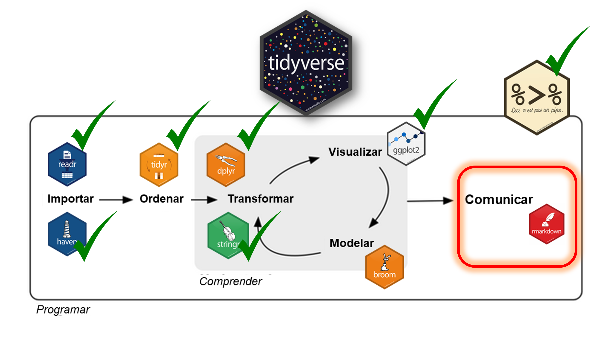

# **Encuentros del 24 AL 28/2 15 a 18 HS**

### Encuentro 1: Presentación del taller. Introducción a las Ciencias Sociales Computacionales y a R. ¿Qué son las CSS y R? ¿Qué es (muy brevemente) la EPH? 
### Encuentro 2: ¿Qué es RBase y RStudio? Operaciones básicas y objetos. 
### Encuentro 3: Manipulación, transformación y procesamiento de datos. "Mundo Tidyverse".
### Encuentro 4: Visualización de datos en R. "Mundo Ggplot2".
### Encuentro 5: Producción de informes y automatización de reportes. "Mundo RMarkdown".


---


# **Ciencias Sociales Computacionales**

## __Nuevas herramientas y polémicas para el análisis social__


####¿Para qué y por qué pensar la relación entre métodos computacionales y Ciencias Sociales? ¿Cómo nos interpela como cientistas sociales? ¿Qué repercusiones trae el giro computacional para el pensamiento social? 

####¿Cuáles son las implicancias para los procesos de investigación? ¿Cambian los instrumentos y cambia toda la teoría social que va con ellos? 

#### ¿Qué aperturas debemos pensar en nuestras carreras de grado y posgrado (contenidos, lenguajes, habilidades) para ser capaces de abordar desafíos de conocimiento transdisciplinares para ampliar la imaginación social? 

#### ¿Qué aprendizajes podemos construir como comunidad académica-educativa? 

#### ¿Cuáles son las habilidades técnicas e intelectuales que necesitamos dominar?

####¿Qué significa ser unx académicx en la era digital? 

#### ¿Quién puede leer y escribir “los números”? 

####¿Cómo es posible formarnos para que nos sintamos igualmente cómodxs con los algoritmos y el análisis de datos, así como con el análisis social y la teoría? 


---
# **¿Qué son las Ciencias Sociales Computacionales?**
- 🔍 **Intersección entre las ciencias sociales, la informática y la estadística.**
- 📊 **Uso de datos masivos y algoritmos para analizar fenómenos sociales.**
- 🌍 **Aplicaciones en sociología, economía, ciencia política y más.**
- 🔍 **Auge de tecnicas de Machine Learning y minería de datos para análisis a gran escala y tiempo real.**

📖 Para ampliar sobre algunos debates: [Ciencias Sociales Computacionales. Entrevista German Rosatti](https://www.reviise.unsj.edu.ar/index.php/tramassociales/article/view/1260)

Otras referencias a chusmear:
- [boyd & Crawford](https://people.cs.kuleuven.be/~bettina.berendt/teaching/ViennaDH15/boyd_crawford_2012.pdf)
- [Cioffi-Revilla](https://link.springer.com/book/10.1007/978-3-319-50131-4)
- [Conte, Paolucci & Castelfranchi](http://www.computational-social-science.net/manifesto)
- [Gualda](https://dialnet.unirioja.es/servlet/articulo?codigo=8238025)
- [Lazer et al.](https://doi.org/10.1126/science.1167742)
- [Salganik (2017)](https://academic.oup.com/jrsssa/article/181/3/917/7072048)
- [Salganik (n.d.) - Video](https://www.bing.com/videos/riverview/relatedvideo?&q=Matthew+Salganik+An+Introduction+to+Computational+Social+Science+-+YouTube&&mid=069DB816734799D4AFA7069DB816734799D4AFA7&&FORM=VRDGAR)


---

# **Ventajas de las Ciencias Sociales Computacionales**

##1. 🚀 **Escalabilidad:** Análisis de grandes volúmenes de datos (Big Data).
##2. 📝 **Reproducibilidad:** Transparencia en los métodos.
##3. 📡 **Nuevas fuentes de datos:** Redes sociales, datos administrativos, Internet, etc. 
##4. 🤖 **Modelado avanzado:** Machine learning, redes neuronales, Procesamiento de Lenguaje Natural (NLP).

---

# **¿Por qué usar R?**

##- 🛠 **Versatilidad:** Análisis, visualización y modelado.
##- 🌍 **Comunidad:** Código abierto con miles de contribuciones.
##- 💾 **Manejo de datos complejos:** Bases de datos, scraping, minería de texto.
##- 📄 **Reproducibilidad:** R Markdown (Encuentro 5) y Quarto documentan cada paso.


---

# Flujo de trabajo de las CSC
####__IMPORTAR, ORDENAR, TRANSFORMAR (MANIPULAR), VISUALIZAR, MODELAR Y COMUNICAR:Las operaciones  en *tidyverse* son fundamentales en ciencia de datos porque permiten transformar datos crudos en información valiosa.__

```{r echo=FALSE, eval=TRUE, out.width='75%', fig.align='center'}

```

---

# Flujo de trabajo de las CSC

<span style="font-size:3em">
__ImportaR__ 🏗️


<span style="font-size:3em">
##- 🏗️ **Sin datos, no hay análisis.**
##- 🏗️**La importación garantiza que la información de diversas fuentes (CSV, bases de datos, APIs, etc.) esté disponible en un formato accesible para el análisis.** 
##- 🏗**En ciencia de datos, los datos suelen venir desorganizados o en distintos formatos; esta fase estandariza la entrada.** 

## -Encuentros 2 y 3.
</span>
---


# Flujo de trabajo de las CSC

<span style="font-size:3em">
__OrdenaR__ 📦


##- 📦️ ** La organización de datos en un formato "tidy" facilita su manipulación y análisis.**

##- 📦️ **En ciencia de datos, trabajar con datos estructurados de forma clara mejora la reproducibilidad y escalabilidad de los análisis.**

## -Encuentro 3.
---

# Flujo de trabajo de las CSC

<span style="font-size:3em">
__TransformaR__ 🔄


##- 🔄️ **Aquí es donde se extrae valor real de los datos.**
##- 🔄️ ** Se pueden filtrar observaciones, crear nuevas variables y resumir información.**
##- 🔄️ **En ciencia de datos, este paso es clave para la *limpieza de datos, el preprocesamiento y feature engineering*.**

## -Encuentro 3.
---

# Flujo de trabajo de las CSC
<span style="font-size:2em">
__VisualizaR__ 📊

###- 📊️ **Los patrones y tendencias muchas veces no son evidentes en tablas de datos.**
###- 📊️ ** La visualización de datos plantea sus propios interrogantes y disputas epistemológicas.**
###- 📊️ **No son neutrales, requieren decisiones concientes.**
###- 📊️ **La comunicacióna de hallazgos a través de gráficos es esencial para la toma de decisiones basada en datos y para la producción de conocimiento.**
### -Encuentro 4.

---

# Flujo de trabajo de las CSC

<span style="font-size:3em">
__Modelar__ 🤖


##- 🤖️ **Permite hacer predicciones, clasificaciones o entender relaciones entre variables.**
##- 🤖️ **Modelos matemáticos y estadísticos ayudan a fundamentar decisiones con rigor analítico.**


## -Encuentros del futuro.
---

# Flujo de trabajo de las CSC

<span style="font-size:3em">
__ComunicaR__📝


##-  📝 **Un análisis potente requiere una comunicación potente.**
##- 📝️**La presentación clara y reproducible de resultados es clave para compartir hallazgos.**
##- 📝️**rmarkdown facilita la documentación del proceso, asegurando que otros puedan replicar y entender el trabajo.**

## -Encuentro 5.

---

# **¡Gracias!**

## ❓ Preguntas o comentarios
