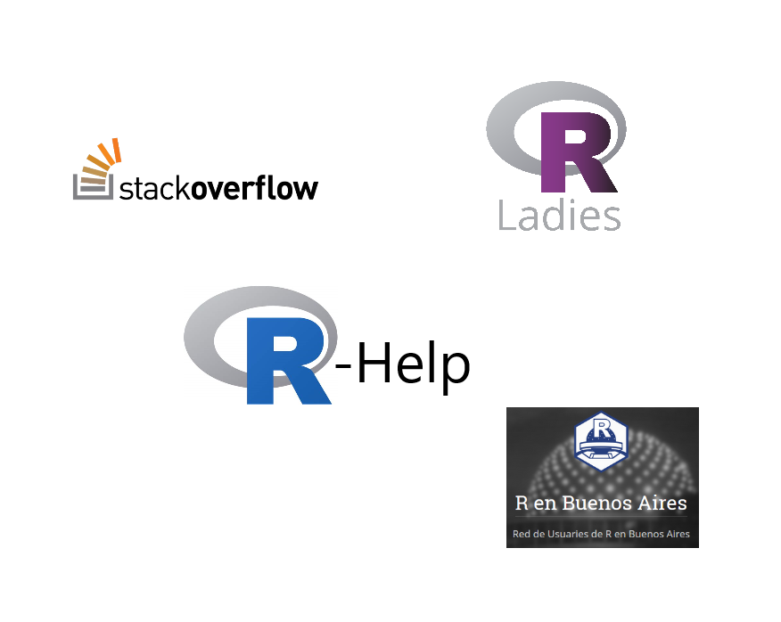

```{r xaringan-themer, include = FALSE}
#devtools::install_github("gadenbuie/xaringanthemer")
library(xaringanthemer)
duo_accent(primary_color = "#006747", secondary_color = "#F5F5F5")
```

class: middle, center

# ¿Qué es [R](https://cran.r-project.org/)?
Material adaptado del trabajo realizado por Pablo Tiscornia y Guido Weksler

---
class: inverse, center

# R es un software abierto

####✅ Gratuito – Sin costos de licencia.
####✅ Personalizable – Modificable según necesidades.
####✅ Comunidad Activa – Desarrollo colaborativo.
####✅ Transparente – Código accesible y auditable.
####✅ Evolución Rápida – Innovación constante.
####📊 Ideal para estadística, ciencia de datos y análisis numérico.


---
class: inverse, center

# R es...

Abierto

```{r echo=FALSE, out.width = '80%', fig.align = 'center'}

```

---
class: inverse

# R es...


###- ✅Un lenguaje para el procesamiento y análisis de datos.
  
###- 🖥️️ El lenguaje troncal es conocido como "R base".
  
###- 📦 Sobre esa base se desarrollan un conjunto de funciones y paquetes que incluso pueden cambiar ciertas formas de programar el mismo lenguaje.

###- 🔑 Importante retener -por ahora- la idea de lenguaje: PAQUETES Y FUNCIONES.
  
  
---
class: middle, center, inverse

background-image: url(img/R1.PNG)
background-size: contain

---

class: middle, center, inverse

background-image: url(img/R2.PNG)
background-size: contain

---
class: middle, center, inverse

background-image: url(img/R3.PNG)
background-size: contain

---
class: middle, center, inverse

background-image: url(img/R4.PNG)
background-size: contain

---
class: middle, center, inverse

background-image: url(img/R5.PNG)
background-size: contain
  
---

class: middle, center

# ¿Por qué R?

---
class: inverse

## ¿Por qué R? 🚀 **Ventajas de R en el análisis de datos**  

#### - 🔄 **Automatización:** Permite **sistematizar tareas repetitivas** y optimizar flujos de trabajo.  
#### - 🛠️ **Personalización:** Posibilidad de **crear funciones a medida** para adaptarse a necesidades específicas.  
#### - 📌 **Reproductibilidad:** Garantiza la **reproducibilidad y estandarización** de procesos.  
#### - ⚡ **Eficiencia:** Destina más memoria al funcionamiento que a la plataforma (**vs SPSS o SAS**).  


---
class: inverse

## ¿Por qué R?

### - Su comunidad potencia la capacidad de consulta y respuesta.


```{r echo=FALSE, out.width = '70%', fig.align = 'center'}
#ver cambiar imagen

```
📖  [RladiesBA](https://rladiesba.netlify.app/)
---
class: inverse

## ¿Por qué R?

###- Consultas sobre los programas estadísticos en Google
  
```{r echo=FALSE, out.width = '100%', fig.align = 'center'}
knitr::include_graphics("img/google_trend.png") 
```

---


class: inverse

## R vs otros programas de licencia paga

- Es gratuito (todas sus versiones, todas sus herramientas, todo el tiempo).

--

- Nada de "crackear" el programa, buscarlo en la web (¿¡Eso es un virus!?) o esperar a ese pendrive salvador con el instalador.

--
  
- Con R se generó una comunidad dedicada a facilitar el acceso al lenguaje y, también, a su desarrollo (los "mortales" podemos crear herramientas en función de los problemas con los que nos enfrentamos).

--
  
- Es más fácil ayudar y que te ayuden (foros, comunidades, tutoriales).


--
  
- R te demanda mayor conocimiento sobre tus datos, tus procesos y también sobre estadística.

---

class: inverse, middle
## Rstudio 🖥
###- 🌎 **Popularidad:** Es el **entorno más utilizado** para programar en R.  
###- 💰 Es una empresa que no cobra por el uso del programa, solo por soporte técnico.  
###- 🔄 **Versatilidad:** También funciona como un **traductor de R** a diferentes lenguajes, permitiendo:  
  ####- 📊 **Trabajar el dato**  
  ####- 📈 **Visualizar resultados**  
  ####- 📝 **Generar reportes** en múltiples formatos: `.doc`, `.xlsx`, `.pdf`, **presentaciones**, **dashboards**, y más.  

---
class: inverse, center, middle

.pull-left[

## R:

<br>

```{r echo=FALSE, out.width = '100%', fig.align = 'center'}

```
]

.pull-right[

## RStudio:

<br>

```{r echo=FALSE, out.width = '100%', fig.align = 'center'}

```
]

---

##🖥️ Diferencia entre RStudio y R Base

###🔹 R Base es el lenguaje de programación estadístico en sí mismo. 

###📜 Un lenguaje de código abierto especializado en estadística y ciencia de datos.
###🖥️ Un entorno básico llamado R GUI (muy simple, solo una consola de comandos).
### 📦 Paquetes y funciones fundamentales para cálculos, modelado estadístico y gráficos.

---
###🔹 RStudio es un entorno de desarrollo integrado (IDE) que facilita el trabajo con R Base. 

####✅ Ventajas de usar RStudio sobre R Base:
####🌟 Interfaz gráfica avanzada (más intuitiva que R GUI).
####📂 Gestión de proyectos para organizar scripts, datos y gráficos.
####📊 Vista en tiempo real de gráficos y datos sin necesidad de guardar archivos.
####📜 Facilita la edición y ejecución de código con resaltado de sintaxis y autocompletado.
####📈 Generación de reportes en Word, PDF, HTML, Dashboards con R Markdown y Shiny.


