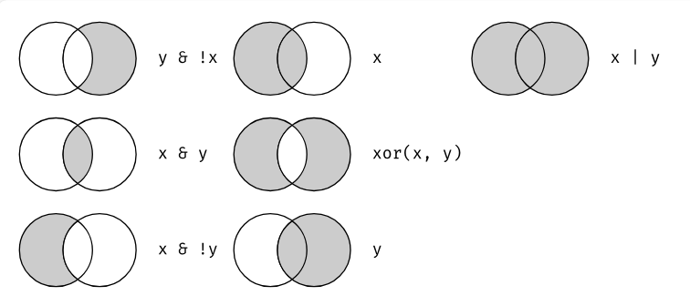

Material adaptado del trabajo realizado por Pablo Tiscornia y Guido
Weksler.


<br>

## ¿Qué es R?

-   Lenguaje para el procesamiento y análisis estadístico de datos.

-   Software libre y de código abierto.

-   Sintaxis básica: R base.

-   Sintaxis incremental[^1]: El lenguaje se va ampliando por aportes de
    universidades, investigadorxs, usuarixs y empresas privadas,
    organizados en paquetes.

[^1]: Más allá de los comandos elementales, comandos más sofisticados
    tienen muchas versiones, y algunas quedan en desuso en el tiempo.

La sintaxis se define como el conjunto de **reglas y principios** que
determinan *cómo* se deben estructurar las instrucciones o declaraciones
en un **lenguaje,** ya sea de programación o un lenguaje natural.

En el contexto de programación, la sintaxis define cómo deben escribirse
los comandos y expresiones para que sean comprendidos e interpretados
correctamente por el compilador o intérprete.

Define la manera en que se deben combinar palabras clave, operadores,
identificadores, delimitadores y otros elementos del lenguaje. Es como
la "gramática" de un lenguaje de programación.

**Errores sintácticos**:

Si el código no sigue las reglas de sintaxis, el programa no podrá
ejecutarse y el intérprete o compilador generará un error.

<br>


### **CRAN: Comprehensive R Archive Network** 📦

CRAN es la **red de archivos integral de R**, una plataforma donde se
almacenan, distribuyen y mantienen paquetes de R. Es esencial para la
comunidad porque:

🔹 **Aloja miles de paquetes** listos para usar.\
🔹 **Garantiza calidad y compatibilidad** con R.\
🔹 **Facilita la instalación y actualización** de herramientas
estadísticas y de ciencia de datos.

🖥️ Se accede desde R con comandos como:

install.packages("nombre_del_paquete")

<br>


-   Rstudio es una empresa que elabora productos asociados al lenguaje
    R, como el programa sobre el que corremos los comandos, y
    extensiones del lenguaje (librerías). Ahora, se llama **Posit**.

-   El programa es *gratuito* y se puede bajar de la [página
    oficial](https://posit.co/downloads/)

    🖥️ **Las 4 Ventanas del IDE de RStudio**


Fuente: <https://github.com/SoyAndrea/tallerEPH>

### **1️⃣ Script / Editor de Código (Parte superior izquierda)**

-   Es el área donde se escriben y guardan **scripts de código (`.R`,
    `.Rmd`, `.qmd`)**.

-   Permite **editar, probar y ejecutar líneas de código** sin
    perderlas.

-   Se puede ejecutar código con:

    -   **CTRL + ENTER** (Ejecuta la línea actual).

    -   **Seleccionar varias líneas + CTRL + ENTER** (Ejecuta varias
        líneas).

### **2️⃣ Consola (Parte inferior izquierda)**

-   Es donde **se ejecuta el código en tiempo real**.

-   Todo lo que se corre en la consola es temporal, a menos que se
    guarde en un script.

-   También muestra **mensajes de error o advertencias** al correr
    código.

### **3️⃣ Environment / History (Parte superior derecha)**

-   **Environment**: Muestra los objetos, variables y datos cargados en
    la sesión.

-   **History**: Guarda un registro de los comandos ejecutados
    recientemente.

### **4️⃣ Files / Plots / Packages / Help / Viewer (Parte inferior derecha)**

-   **Files** 📁 → Permite navegar por archivos y carpetas del proyecto.

-   **Plots** 📊 → Muestra gráficos generados con **ggplot2, base R,
    etc.**

-   **Packages** 📦 → Permite instalar, actualizar y gestionar paquetes
    de R.

-   **Help** ❓ → Muestra documentación de funciones en R (`?función`).

-   **Viewer** 🌍 → Muestra documentos interactivos como HTML,
    Dashboards y Shiny.

## Diferencias con otros software


Algunas de las características principales de R:

-   Gratuito.
-   Funciona principalmente por líneas de código (Aunque ya hay paquetes
    que permiten ejecutar comandos desde el menú y los botones sin tener
    que esribir código).
-   Trabaja las bases de microdatos de forma virtual y no fisica, lo que
    permite disponer de varias al mismo tiempo sin mayor dificultad (no
    requiere abrir cada base, trabajarla por separado y luego cerrarla),
    ni exiige guardar fisicamente los cambios.
-   Comunidades-RUGs (R Users Gropus): Aportes de usuarixs.
-   Extensible a otros lenguajes y usos (presentación como esta, diseño
    de aplicaciones)
-   Facilidad para automatizar procesamientos periódicos

# Lógica sintáctica en R base

Con *R base* nos referimos a los comandos básicos que vienen
incorporados en R, sin necesidad de cargar paquetes complementarios.

Se refiere al conjunto fundamental de funciones y herramientas que
vienen incluidas con la instalación estándar de R. Incluye funciones
para manipulación de datos, operaciones matemáticas, estadística y
gráficos simples, sin necesidad de instalar paquetes adicionales.

```{r echo=TRUE}
mean(c(1, 2, 3, 4, 5))  # Calcula la media de un vector
plot(1:10, 1:10)       # Crea un gráfico simple
```

## Objetos

-   Los **Objetos/Elementos** constituyen la categoría esencial de R.

-   Es cualquier entidad que almacena datos o funciones en la memoria
    del entorno de trabajo. Todo en R se guarda en **objetos**, lo que
    permite manipular y analizar la información de forma estructurada.

-   De hecho, **todo en R es un objeto,** y se almacena con un nombre
    específico que **no debe poseer espacios**.

Un número, un vector, una función, la progresión de letras del
abecedario, una base de datos, un gráfico, constituyen para R objetos de
**distinto tipo**.

Los objetos que vamos creando a medida que trabajamos pueden
visualizarse en la panel derecho superior de la pantalla
("*Environment*").

-   **Nombrar objetos.** Algunas reglas, sugerencias y convenciones

🚫 No se aceptan espacios

Objeto llamado nombre y apellido

🚫 No se puede empezar con un número

Objeto llamado 1_objeto

👎🏼 Evitar símbolos (&, \^, /, !) y acentos

Objeto llamado países

👎🏼 Evitar que objetos y funciones tengan el mismo nombre

👍🏼 todoenminuscula

👍🏼 TODOENMAYUSCULA

👍🏼 espacio.con.punto

🤘🏼 espacio_con_guion_bajo

## Operadores

Son los símbolos que le indican a R que debe realizar una tarea.
Mediante la combinación de datos y operadores es que logramos que R haga
su trabajo.

Existen operadores específicos para cada tipo de tarea. Los tipos de
operadores principales son los siguientes:

-   De asignación
-   Aritméticos
-   Relacionales
-   Lógicos

### Operadores de asignación

-   **\<-**
-   **=**

Ambos operadores sirven para definir objetos, es decir, **asignarle un
valor**. Sin embargo, en la práctica se suele utilizar el operador
**`<-`** para la definición de objetos, por más que el **`=`** sea
equivalente. **A la izquierda** del **`<-`** debe ubicarse el nombre que
tomará el elemento a crear. **Del lado derecho** debe ir la definición
del mismo.

En R, el símbolo de asignación \<- se usa comúnmente en lugar del signo
igual = para asignar valores a variables. Existen varias combinaciones
de teclas rápidas para escribirlo de manera más eficiente:

Atajo de teclado para **\<-** en RStudio: **Windows/Linux: Alt + -
(guion)** Mac: Option + - (guion)

Veamos un ejemplo:

```{r echo=TRUE}
A <- 1
A 
```

Al definir un elemento, el mismo queda guardado en el ambiente del
programa, y podrá ser utilizado posteriormente para observar su
contenido o para realizar una operación con el mismo.

```{r echo=TRUE}
A + 6
```

Al correr una linea con el nombre del objeto, la consola del programa
nos muestra su contenido. Entre corchetes observamos el número de orden
del elemento en cuestión.

```{r echo=TRUE}
B <- 2
B
```

\*\*Para ejecutar línea actual o selección Ctrl + Enter (O botón "Run")
(Abajo les dejamos los más utilizados)

**`<-`** y **`=`** son operadores **unidireccionales**, es decir que:\
`A <- B` o `A = B`implica que **A** va tomar como valor el contenido del
objeto **B**, y no al revés.

```{r echo=TRUE}
A <- 150
B <- 132
```

```{r echo=TRUE}
A = B #Ahora A toma el valor de B 
print(A)

#(B continua conservando el mismo valor)
print (B)
```

En R, cuando se define un objeto con el mismo nombre de un objeto
previamente existente, el último **reemplaza al primero. ("Lo pisa").**

### Operadores aritméticos:

-   Suma: `+`
-   Resta: `-`
-   Cociente: `/`
-   Multiplicación: `*`
-   Potencia: `^`

```{r echo=TRUE}
#suma 
5+6

#Resta
6-8

#cociente
6/2

#multiplicación
6*2

#Potencia
3^3

```

### Operadores lógicos relacionales:

Los **operadores lógicos** son usados para describir relaciones,
expresadas como verdadero (TRUE) o falso (FALSE).

-   Mayor: `>`

-   Mayor o igual: `>=`

-   Menor: `<`

-   Menor o igual: `<=`

-   Igual: `== (ojo con el igual)`

-   Distinto: `!=`



```{r echo=TRUE}
#Redefinimos los valores A y B
A <- 10
B <- 20

#Realizamos comparaciones lógicas
A > B
A >= B
A < B
A <= B
A == B
A != B

```

Como muestra el siguiente ejemplo, el resultado de una operación lógica
puede almacenarse como el valor de un objeto.

```{r}
C <- A != B
C
```

### Otros operadores lógicos:

-   Ó: `|`
-   Y: `&`

```{r echo=TRUE}
#Redefinimos los valores A y B
A <- 50
B <- 72
#Realizamos comparaciones lógicas

(A > 60 & B > 65)
(A < 60 | B < 65) 

```

> Practica:\
> 1) Crear un objeto llamado "mi_numero" que almecene un número que
> ustedes quieran. ¿Qué pasa si lo intentan nombrar como "mi numero"?\
> 2) Realizar alguna operación matemática con el objeto y guardar el
> resultado como un nuevo objeto llamado "otro_numero".\
> 3) Comprobar lógicamente si el segundo objeto es igual a 10.\
> 4) Comprobar lógicamente si alguno de los dos objetos es mayor a 10

```{r,eval=FALSE,include=FALSE}
mi_numero <- 9
otro_numero <- mi_numero *2
otro_numero == 10
(otro_numero > 10 | mi_numero > 10) 

```

## Caracteres especiales

-   R es sensible a mayúsculas y minúsculas, tanto para los nombres de
    las variables, como para las funciones y parámetros.
-   Los **espacios en blanco** y los **carriage return** (*enter*) no
    son considerados por el lenguaje. Los podemos aprovechar para
    emprolijar el código y que la lectura sea más simple[^2].

[^2]: veremos que existen ciertas excepciones con algunos paquetes más
    adelante.

<!-- -->

-   El **numeral** `#` se utiliza para hacer **comentarios.** Todo lo
    que se escribe después del \# no es interpretado por R. Se debe
    utilizar un \# por cada línea de código que se desea anular.

```{r,eval=FALSE,include=FALSE}
mi_numero <- 9 #esto es un comentario, es útil para dejar notas, cuestiones a revisar, para explicar el código, por ejemplo. 

```

-   Los **corchetes** `[]` se utilizan para **acceder** a un objeto:

    -   en un vector[n° orden]
    -   en una tabla[fila, columna]
    -   en una lista[n° elemento]

-   El signo **\$** también es un método de acceso. Particularmente, en
    los dataframes, nos permitira acceder a una determinada columna de
    una tabla.

-   Los **paréntesis**`()` se utilizan en las **funciones para definir
    los parámetros**.

-   Las **comas** `,` se utilizan para separar los parametros al
    interior de una función.

------------------------------------------------------------------------

## Tipos de objetos:

Existen una gran cantidad de objetos distintos en R, en lo que respecta
al taller trabajaremos principalmente con 4 de ellos:

-   **Valores**

-   **Vectores**

-   **Data Frames**

### Valores

Nos vamos a referir como "valores" a los objetos de una sola dimensión.
Por ejemplo, un número, una palabra, una fecha.

En R la unidad mínima para trabajar son los valores:

-   1 es un valor (numérico),
-   "uno" es un valor (cáracter),
-   "1" es un valor (cáracter) y
-   "Esto es un uno" también es un valor (cáracter).

Los valores (y los objetos en general) en R pueden ser de distintas
*clases*. Veamos algunos ejemplos:

**Clase Numeric (numéricos)**

```{r echo=TRUE}
A <- 1
class(A)
```

<br>

**Clase 'Character' (caracter)**

En **R**, un **valor caracter** (también llamado **cadena de texto** o
**string**) es un dato de tipo **character** que representa texto. Se
define encerrándolo entre comillas dobles (`" "`) o simples (`' '`).

```{r echo=TRUE}
A <- "Hola, ¿qué tal?"

class(A)
```

<br>

**Clase 'Date' (caracter)**

```{r echo=TRUE}
class(Sys.Date())
```

### Vectores

Un vector es un **conjunto de valores de la misma clase**. Puede haber
vectores númericos, character, date, etc.

Para crear un **vector** utilizamos el comando `c()`, de combinar.

```{r echo=TRUE}
# Vector numérico
vec_num <- c(1, 2, 2,2,3,2,1, 2, 1, 1, 1)
class(vec_num)

# Vector de caracteres
dias_char <- c("Lunes","Viernes","Viernes","Jueves",
       "Martes", "Martes","Miercoles","Martes",
       "Miercoles")
class(dias_char)

# Vector de tipo fecha
vec_fecha <- Sys.Date()+2

class(vec_fecha)

```

La función **table** nos permite hacer un tabulado univariado de la
cantidad de casos para cada categoría de un vector (también sirve para
tabulados bivariados). Contemos la cantidad de casos por dia de la
semana:

```{r}
table(dias_char)
```

#### **Vectores de tipo 'factor'**

En general se usa para **datos ordinales**. Es decir, para una variable
cualitativa para la cual necesitamos establecer **cierto orden en sus
posibles valores**.

**Crear o transforma una variable en *factor* nos será sumamente útil
para realizar tablas o gráficos siguiendo un orden deseado para las
categorías.**

```{r echo=TRUE}
# Una propiedad del factor: las etiquetas.
dias_factor <- factor(dias_char,
                 levels = c("Lunes",
                            "Martes",
                            "Miercoles",
                            "Jueves",
                            "Viernes"))
class(dias_factor)
```

Veamos ahora como se muestra un tabulado con la variable como factor

```{r}
table(dias_factor)
```

La diferencia entre un *character* y un *factor* es que el último tiene
*solo algunos valores* permitidos (levels), con un **orden interno
predefinido**.

Para almacenar como factor una variable, el software está internamente
asignando un número a cada categoría. **Tener cuidado si piensan operar
luego sobre dicha variable.**

```{r}
as.numeric(dias_factor)
```

#### Operaciones con vectores

Con los vectores numéricos se pueden hacer operaciones como, por
ejemplo: sumarle 2 a cada elemento del **vector** anterior.

```{r echo=TRUE}
D <- c(1, 3, 4)
D <- D + 2
D
```

-   Sumarle 1 al primer elemento, 2 al segundo, y 3 al tercer elemento
    del **vector** anterior

```{r echo=TRUE}
E <- D + 1:3 #esto es equivalente a hacer 3+1, 5+2, 6+9 
E
```

`1:3` significa que queremos todos los números enteros desde 1 hasta 3.

#### Métodos de acceso

Para trabajar con ciertos valores de un vector (u otro objeto de más de
una dimensión) existen los denominados *métodos de acceso*. Para acceder
a un valor de cierto vector utilizamos los signos `[ ]` y podemos
buscarlo/s a través del número de orden

```{r echo=TRUE}
# Si quiero al valor 2 del objeto E:
E 
E[2]
```

Si nos interesa quedarnos con dicho valor, al buscarlo lo asignamos a un
nuevo objeto.

```{r echo=TRUE}
E_posicion2 <-  E[2]
E_posicion2
```

Para **borrar** un objeto del ambiente de trabajo, utilizamos la función
*`rm()`*

```{r error=TRUE}
rm(E_posicion2)
E_posicion2
```

También podemos cambiar el texto del segundo elemento de E, por el texto
"Pablo"

```{r echo=TRUE}
E
E[2] <- "Pablo"
E

# Tener cuidado al modificar el tipo de uno de los valores y no el de todos los del objeto:
class(E)
```

> Practica:\
> 1) Crear un vector numerico de 7 valores, elegir numeros entre 1 y 50\
> 2) Comprobar logicamente cuáles de ellos son menores a 25\
> 3) Extraer del vector el 3er y 5to valor\
> 4) Extraer del vector todos los valores menores a 25

```{r,eval=F,include=F}
vec_practica <- c(4,53,5,1,7,30,21)
vec_practica < 25
vec_practica[c(3,5)]
vec_practica[vec_practica < 25]

```

### Data frame

Un *data frame* es una **estructura de datos de dos dimensiones o
tabla**, donde cada **columna** representa una **variable**, y cada
**fila** una **observación**. **Pueden contener datos de diferentes
clases.** Puede ser considerado como un conjunto de vectores de igual
tamaño, donde cada vector (columna) tiene que tener datos del mismo
tipo, pero las clases de vectores que conforman la tabla pueden ser
distintas. Entonces, cada observación (fila) está compuesta por datos
que pueden ser de distinto tipo.

Este objeto es central en el proceso de trabajo, ya que es la
**estructura más usada para realizar análisis de datos**, y suele ser la
forma en que se cargan datos externos para trabajar en el ambiente de R,
y en que se exportan los resultados de nuestros trabajo.

Veamos un ejemplo de *data frame* creado a partir de la combinación de
vectores:

```{r echo=TRUE}
AGLOMERADO  <- c(10,27,27,27,10)

SEXO  <-  c("Varon","Mujer","Mujer","Varon","Mujer")

EDAD  <-  c(60,54,18,27,32)

Datos <- data.frame(AGLOMERADO, SEXO, EDAD)
Datos
class(Datos)
```

```{r echo=TRUE}
Datos$AGLOMERADO_factor <- factor(Datos$AGLOMERADO, 
                           levels = c(10, 27), 
                           labels = c("Gran Mendoza", "Gran San Juan"))

# Ver el resultado
print(Datos)

```


Tal como en un **vector** podemos acceder a los elementos a través de
los `[ ]`, en un **dataframe** lo hacemos de la forma
**`[fila, columna]`**.

En los data.frame tenemos, por definición, más de una columna
(variable). Para acceder a alguna de ellas podemos utilizar el operador
**`$`**.

```{r}
Datos[3,2]
Datos[4,3]

Datos$AGLOMERADO
class(Datos$AGLOMERADO)

Datos$AGLOMERADO[2]
```

¿que pasa si hacemos `Datos$AGLOMERADO[3,2]` ?

```{r error=TRUE}
Datos$AGLOMERADO[3,2]
```

Nótese que el último comando tiene un número incorrecto de dimensiones,
porque estamos refiriendonos 2 veces a la columna AGLOMERADO.

Acorde a lo visto anteriormente, el acceso a los **dataframes** mediante
`[ ]` puede utilizarse también para realizar filtros.

Por ejemplo, puedo utilizar los `[ ]` para obtener del **dataframe**
`Datos` unicamente los registros del AGLOMERADO 32:

```{r error=TRUE}
Datos[Datos$AGLOMERADO==10, ]

```

La lógica del paso anterior sería: Accedo al dataframe `Datos`, pidiendo
únicamente conservar las filas (por eso la condición se ubica a la
*izquierda* de la `,`) que cumplan el requisito de pertenecer a la
categoría **10** de la variable **AGLOMERADO**.

<br>

Alternativamente, también dentro de RBase tengo la función `subset()`
con la cual puedo filtrar de manera **mucho más intuitiva**. Le paso
como primer parámetro el Dataframe en cuestión y como segundo parámetro
la condición lógica que deseo.

```{r}
subset(Datos,AGLOMERADO==10)
```

Si quiero realizar un cálculo sobre el subgrupo resultante del filtro
anterior, puedo guardar este dataframe como un nuevo objeto, y acceder a
alguna columna en particular. Por ejemplo, podría querer calcular la
media de la edad para aquellas personas que residen en el aglomerado 10.

```{r error=TRUE}
aglo10 <- subset(Datos,AGLOMERADO==10)
mean(aglo10$EDAD)

# mean(subset(Datos,AGLOMERADO==10)$EDAD) # PODRIA HACERLO TODO DE UNA ASÍ
```

<br>


## Funciones:

Las **funciones** son series de procedimientos estandarizados, que toman
como *input* determinados **argumentos** a fijar por le usuarie
(llamados **parámetros**), y devuelven un resultado acorde a la
aplicación de dichos procedimientos. Su lógica de funcionamiento es:\
`funcion(argumento1 = arg1, argumento2 = arg2)`

Veamos ahora algunos ejemplos para comprender su funcionamiento:

-   paste() : concatena una serie de caracteres, indicando por última
    instancia como separar a cada uno de ellos.

-   paste0(): concatena una serie de caracteres sin separar.

-   sum(): suma de todos los elementos de un vector.

-   mean() promedio aritmético de todos los elementos de un vector.\

```{r}
paste("Pega","estas", 4, "palabras", sep = " ")
paste("Esto", "es", "un texto", "con", "seis", "valores", sep = "_")

#Puedo concatenar caracteres almacenados en objetos
a <- c(1, 2, 3)
b <- "con"
c <- c(4, 5, 6)

paste(a,b,c,sep = "-")

# Paste0 pega los caracteres sin separador
paste0(a,b,c)

# Repasando un comando ya visto...
1:5

# Función para sumar
sum(1:5)

# Para calcular medias
mean(1:5)

#Máximo
max(Datos$EDAD)

#Valores únicos de un vector
unique(Datos$AGLOMERADO)

```

> Practica: Abrir la pequeña base contenida en el archivo
> "comunas.xlsx". Luego:\
> 1) Calcular el area promedio de las comunas\
> 2) Calcular el area total de la Ciudad de Buenos Aires\
> 3) Crear un nuevo dataframe que contenga solo las columnas AREA y
> COMUNA\
> 4) Crear un nuevo dataframe que contenga todas las columnas, pero solo
> las filas donde el area sea mayor a 15 millones.

```{r,eval=F,include=F}
#install.packages("readxl") 
library (readxl)

comunas <- read_excel("bases/comunas.xlsx")
mean(comunas$AREA)
sum(comunas$AREA)
area_comunas_df<- comunas[,c("AREA","COMUNAS")]
grandes_df<- comunas[comunas$AREA > 15000000,]

```

# Instalación de paquetes complementarios a R Base

Hasta aquí hemos visto múltiples funciones que están contenidas dentro
del lenguaje básico de R. Ahora bien, al tratarse de un software libre,
distintxs usuarixs de R contribuyen sistemáticamente a expandir este
lenguaje mediante la creación y actualización de **paquetes**
complementarios. **Lógicamente, los mismos no están incluidos en la
instalación inicial del programa, pero podemos descargarlos e
instalarlos con el siguiente comando**:

```         
install.packages("nombre_del_paquete") 
```

Al ejecutar el comando se descargarán de la pagina de
[CRAN](www.cran.r-project.org) los archivos correspondientes al paquete
hacia el directorio en donde hayamos instalado el programa. Típicamente
los archivos se encontrarán en \*\*C:\Program
Files\R\R-4.0.4\library\*\*, siempre con la versión del programa
correspondiente.

Los paquetes sólo se instalan una vez en la computadora (si cambias de
computadora, tenés que volver a instalarlo). Una vez instalado el
paquete, cada vez que abramos una nueva sesión de R y querramos utilizar
el mismo debemos **cargarlo al ambiente de trabajo** mediante la
siguiente función:

```         
library(nombre_del_paquete)
```

Nótese que al cargar/activar el paquete no son necesarias las comillas.

# Lectura y escritura de archivos

A la hora de importar una base de datos nos podemos llegar a enfrentar a
distintos tipos de archivos. En R contamos con **distintos paquetes y
funciones** según el **tipo de extensión** del archivo:

```{r echo=FALSE, message = FALSE,warning=FALSE}
library(tidyverse)
library(kableExtra)

importacion <- tibble(
  "Tipo de archivo" = c("Texto Plano",
                        "Texto Plano",
                        "Texto Plano",
                        "Extension de R",
                        "Extension de R",
                         "Otros Softwares",
                         "Otros Softwares",
                         "Excel",
                         "Excel"),
           "Paquete" =c("readr",
                        "readr",
                        "readr",
                        "RBase",
                        "RBase",
                        "haven",
                        "haven",
                        "openxlsx",
                        "readxl"),
             "Extension" =c(".csv",
                          ".txt",
                          ".tsv",
                          ".RDS",
                          ".RDATA",
                          ".dta",
                          ".sav",
                          ".xlsx",
                          ".xls"),
         "Funciones" = c("read_csv()",
                           "read_txt()","read_tsv()",
                           "readRDS()", "open()",
                           "read_dta()","read_spss()",
                           "read.xlsx()","read_excel()")    
)  

kableExtra::kable(importacion, format = 'html') %>%
  kable_styling(bootstrap_options = c("striped", "hover")) %>% 
  collapse_rows(columns = 1)
```

## Archivos de texto plano (csv, txt)

Se llaman así porque solo contienen texto sin formato.

En archivos de texto plano, el paquete se recomienda usar el paquete
**readr** (que forma parte de tidyverse). Las diferencias entre cada una
de sus funciones está en los parámetros que poseen para mejorar la
importación.

```{r echo=FALSE, warning=TRUE}
#knitr::include_graphics("img/read_csv.png")
```

Es importante tener en cuenta que una base de datos que proviene de
archivos *.txt*, o *.csv* puede presentar diferencias en cuanto a los
siguientes parametros:

¿Qué es lo que indican algunos de los parámetros que tenemos en la
imagen?

-   encabezado (¿Tiene o no una primera fila con los nombes de las
    variables?)
-   delimitador (¿Cómo están separadas las variables en el archivo?: Ej:
    `,`, `;`, tab)
-   separador decimal (¿Cómo figuran los números en la base? Ej:
    ¿10.000, 10000 o 10,000)
-   quotes: ¿Como están indicados los valores de las variables de texto
    en la base?, ¿Aparecen entre comillas?

<br>

Un ejemplo de cómo importar un archivo de tipo *delimitado por comas*

```         
dataframe <- read.delim(file, header = TRUE, sep = ",", quote = "\"", dec = ".", fill = TRUE, comment.char = "", ...) 
```

Vamos con una base de la EPH (base individual - 1er trimestre 2017)

En el parametro `file` tengo que especificar el nombre completo del
archivo, incluyendo el directorio donde se encuentra. Lo más sencillo es
abrir comillas, apretar `Tab` y se despliega el menú de las cosas que
tenemos en el directorio de trabajo. Si queremos movernos hacia arriba
en el directorio, agregamos `../`

```{r echo=TRUE, message=FALSE, warning=FALSE}
individual_t117 <- read.table(file = 'bases/usu_individual_t117.txt',
                           sep=";", 
                           dec=",", 
                             header = TRUE, 
                             fill = TRUE)
```

La base de la EPH cuenta con más de 58.000 registros y 177 variables. Al
trabajar con bases de microdatos, resulta conveniente contar con algunos
comandos para tener una **mirada rápida** de la base, antes de comenzar
a realizar los procesamientos que deseemos.

Veamos algunos de ellos:

```{r}
View(individual_t117) # Abre la base en una ventana aparte

names(individual_t117)[1:10] # Devuelve el nombre de  las variables. Le pido solo los primeros 10

summary(individual_t117)[ ,c(8,10,31,133)] # Devuelve algunas medidas de resumen. Le pido ciertas columnas

head(individual_t117)[ ,1:5] # Devuelve sólo los primeros valores para las columnas seleccionadas

unique(individual_t117$REGION)# Muestra los únicos valores que toma una variable

# Notar que seguimos utilizando funciones de R base ya que no necesitamos cargar ningún 'paquete' para utilizarlos
```

-   **Funciones para una primera mirada a la base de datos:**

| Función | Acción |
|-------------------------|-----------------------------------------------|
| `dim()` | Nos dice cuántas filas y columnas tiene la base |
| `colnames()` | Devuelve todos los nombres de las variables de la base |
| `str()` | Devuelve una vista preliminar de la estructura de las variables |
| `summary()` | Devuelve un resumen de medidas centrales para variables numéricas y características para variables de texto |
| `class()` | Chequea el tipo de objeto |
| `length()` | Devuelve la cantidad de elementos de un objeto |
| `table()` | Frecuencia simple o bivariada de una variable |
| `is.na()` | Verifica la presencia de valores `NA` (missing) en la base/variable |
| `mean()` | Calcula el valor promedio de una variable numérica |

```{r}
# 
dim(individual_t117)	#Nos dice cuántas filas y columnas tiene la base
colnames(individual_t117)	#Devuelve todos los nombres de las variables de la base
str(individual_t117)	#Devuelve una vista preliminar de la estructura de las variables
summary(individual_t117$CH06)	#Devuelve un resúmen de medidas centrales para variables numéricas y características para variables de texto

#length(individual_t117)	#Devuelve la cantidad de elementos de un objeto
#table(individual_t117$AGLOMERADO)	#Frecuencia simple o bivariada de una variable
#is.na(individual_t117$CH06)	#Verifica la presencia de valores NA (missinh) en la base/variable
mean(individual_t117$CH06)	#Calcula el valor promedio de una variable numércia


```

## Excel

Para leer y escribir archivos excel debemos utilizar los comandos que
vienen con la librería ´´´openxlsx´´´

```{r, warning=FALSE}
library(openxlsx) 

# Creamos una tabla cualquiera de prueba
x <- 1:10
y <- 11:20
tabla_de_R <- data.frame(x, y)
tabla_de_R

# Escribimos el archivo
write.xlsx( x = tabla_de_R, file = "archivo_tabla.xlsx",
            row.names = FALSE)
```

Dónde lo guardó? Si trabajamos con un proyecto, R establece un
directorio por default que es aquella carpeta donde hayamos creado el
proyecto. Podemos entrar a las sub-carpetas agregando niveles con las
´´´**/**´´´ y al final escribiendo el nombre del archivo con su
extensión (´´´archivo_tabla.xlsx´´´)

# Directorio de trabajo

A la hora de trabajar con archivos que tenemos guardados (o queremos
guardar) en nuestra computadora, es importante tener en cuenta que R
siempre está operando con un directorio de trabajo específico. Este
directorio será el punto de partida para importar archivos al ambiente
de R, o exportar objetos del ámbiente y guardarlos como archivos nuevos
en nuestra PC.

Con la función `getwd()` podemos visualizar la ruta que el programa
tiene seteada como directorio de trabajo:

```{r}
getwd()
```

Supongamos que quisieramos setear el directorio de trabajo en nuestra
carpeta de "Fuentes", con el fin de facilitar la importación de bases de
datos. La función setwd() nos permite realizar esto.

```{r eval=FALSE, message=FALSE, warning=FALSE, include=TRUE}
setwd("C:/Users/usuario/Desktop/Guido/Trabajo/Cursos Intro a R/Fuentes")
```

> ¿ **Que problema tiene setear la ruta de trabajo de esta manera?**

Cuando especifico de esta forma un directorio de trabajo en mi
computadora para importar y exportar archivos:

-   Si le comparto código y archivos a otra persona **no** podrá
    abrirlos.\
-   Si cambio de lugar la carpeta que contiene en mi computadora,
    tampoco podré abrir los archivos.

Rstudio tiene una herramienta muy útil de trabajo que son los
**proyectos**.


Los **proyectos** permiten mantener un ambiente de trabajo delimitado
por cada uno de nuestros trabajos. Es decir:

-   El directorio de trabajo siempre toma como punto inicial la carpeta
    donde esta ubicada el archivo **.Rproj**
-   El Environment es específico de nuestro proyecto. No se nos mezclará
    con resultados de código que podamos correr en otros proyecos.

**Un proyecto no es un sólo script, sino toda una carpeta de trabajo.**

Para crearlo, vamos al logo de nuevo projecto (Arriba a la derecha de la
panatalla), y elegimos la carpeta de trabajo.

{width="410"}{width="410"}\

# Atajos para ejecutar código en RStudio

## Atajos básicos

| Acción | Atajo en Windows/Linux | Atajo en Mac |
|------------------------|------------------------|------------------------|
| Ejecutar línea actual o selección | `Ctrl + Enter` | `Cmd + Enter` |
| Ejecutar todo el script | `Ctrl + Shift + S` | `Cmd + Shift + S` |
| Ejecutar hasta el final del script | `Ctrl + Shift + Enter` | `Cmd + Shift + Enter` |
| Ejecutar todas las líneas anteriores al cursor | `Ctrl + Alt + B` | `Cmd + Option + B` |
| Ejecutar todas las líneas siguientes al cursor | `Ctrl + Alt + E` | `Cmd + Option + E` |

## Atajos extras útiles en RStudio

| Acción                      | Atajo en Windows/Linux | Atajo en Mac      |
|-----------------------------|------------------------|-------------------|
| Limpiar consola             | `Ctrl + L`             | `Cmd + L`         |
| Insertar `%>%` (pipe)       | `Ctrl + Shift + M`     | `Cmd + Shift + M` |
| Comentar/descomentar líneas | `Ctrl + Shift + C`     | `Cmd + Shift + C` |
| Abrir una nueva consola     | `Ctrl + Shift + N`     | `Cmd + Shift + N` |
| Buscar en el script         | `Ctrl + F`             | `Cmd + F`         |
