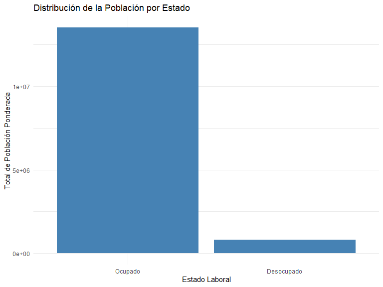
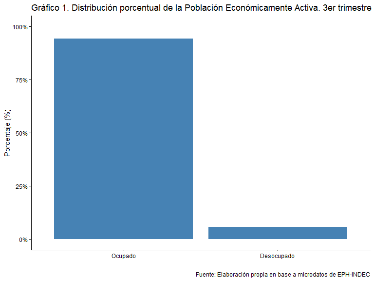

# Introducción

En esta clase vamos centrarnos en tablas y gráficos. Para las tablas tomaremos el paquete `knitr` cuya función `kable` nos va a ayudar a hacer tablas bien piolas y que una versión mas copada la tendremos con `kableExtra` y para los gráficos al glorioso `ggplo2` que lo tenemos en el superpaquete `tidyverse` A lo largo de la sesión, abordaremos los siguientes temas:

✅ **Parte 1: ¿Qué es y cómo funciona `{kableExtra}`?**
✅ **Parte 2: ¿Qué es y como funciona `{ggplot2}`?.** C
✅ **Parte 3: Full práctica.** intentaremos sacarle la ficha al asunto.


La clase tiene una duración de **2 horas y 30 minutos**, con **dos
recreos de 15 minutos** para que podamos despejarnos y mover las
piernas.

# Parte 1: ¿Qué es y cómo funciona **`kableExtra`**?

Como dijimos mas o menos, el paquete `kableExtra` extiende la funcionalidad de `kable()` del paquete `knitr`, permitiendo crear tablas bien formateadas en diferentes formatos, como HTML, LaTeX y Markdown. Este paquete es particularmente útil para la creación de reportes en `RMarkdown` que veremos en la ultímisima clase.

# Instalación/Carga de paquetes en R

Para instalar un paquete desde CRAN, usamos:


``` r
install.packages("eph") # Instala el paquete eph
install.packages("knitr") #Que tiene kable original
install.packages("kableExtra")  # Instala el paquete kableExtra
install.packages("tidyverse")  # Que instala el paquete ggplot2 
```

Para cargar un paquete ya instalado:


``` r
library(tidyverse)  # Carga ggplot2 en la sesión de R así con el resto si lo instalaron antes
```

Para ver los paquetes instalados en tu sistema:


``` r
installed.packages()[,1]  # Muestra una lista de paquetes instalados
```

```
##               abind                ACEP            antiword             arcenso 
##             "abind"              "ACEP"          "antiword"           "arcenso" 
##                 ash         AsioHeaders             askpass          assertthat 
##               "ash"       "AsioHeaders"           "askpass"        "assertthat" 
##                  av           backports           base64enc          bayestestR 
##                "av"         "backports"         "base64enc"        "bayestestR" 
##                  BH                bigD              binman                 bit 
##                "BH"              "bigD"            "binman"               "bit" 
##               bit64              bitops                blob                brew 
##             "bit64"            "bitops"              "blob"              "brew" 
##                brio               broom               bslib              cachem 
##              "brio"             "broom"             "bslib"            "cachem" 
##               callr                 car             carData               cards 
##             "callr"               "car"           "carData"             "cards" 
##             caTools          cellranger              chattr           checkmate 
##           "caTools"        "cellranger"            "chattr"         "checkmate" 
##            chromote            classInt                 cli               clipr 
##          "chromote"          "classInt"               "cli"             "clipr" 
##               clock         collections          colorspace          commonmark 
##             "clock"       "collections"        "colorspace"        "commonmark" 
##              config          conflicted                coro         correlation 
##            "config"        "conflicted"              "coro"       "correlation" 
##            corrplot             cowplot               cpp11              crayon 
##          "corrplot"           "cowplot"             "cpp11"            "crayon" 
##         credentials           crosstalk                crul                curl 
##       "credentials"         "crosstalk"              "crul"              "curl" 
##           cyclocomp          data.table          datawizard                 DBI 
##         "cyclocomp"        "data.table"        "datawizard"               "DBI" 
##              dbplyr        densEstBayes               Deriv                desc 
##            "dbplyr"      "densEstBayes"             "Deriv"              "desc" 
##            devtools             diagram               dials          DiceDesign 
##          "devtools"           "diagram"             "dials"        "DiceDesign" 
##             diffobj              digest             discrim      distributional 
##           "diffobj"            "digest"           "discrim"    "distributional" 
##                doBy            doFuture             downlit               dplyr 
##              "doBy"          "doFuture"           "downlit"             "dplyr" 
##                  DT              dtplyr               e1071          effectsize 
##                "DT"            "dtplyr"             "e1071"        "effectsize" 
##            ellipsis                 eph            evaluate               expss 
##          "ellipsis"               "eph"          "evaluate"             "expss" 
##           extrafont         extrafontdb               fansi              farver 
##         "extrafont"       "extrafontdb"             "fansi"            "farver" 
##             fastmap           flipbookr         fontawesome   fontBitstreamVera 
##           "fastmap"         "flipbookr"       "fontawesome" "fontBitstreamVera" 
##      fontLiberation          fontquiver             forcats             foreach 
##    "fontLiberation"        "fontquiver"           "forcats"           "foreach" 
##         formattable             Formula               fresh                  fs 
##       "formattable"           "Formula"             "fresh"                "fs" 
##               furrr              future        future.apply              gargle 
##             "furrr"            "future"      "future.apply"            "gargle" 
##             gdtools            generics                gert              gfonts 
##           "gdtools"          "generics"              "gert"            "gfonts" 
##               ggalt           gganimate              ggdist           ggfittext 
##             "ggalt"         "gganimate"            "ggdist"         "ggfittext" 
##             ggforce               ggmap             ggplot2             ggrepel 
##           "ggforce"             "ggmap"           "ggplot2"           "ggrepel" 
##            ggridges           ggspatial              ggtext            ggthemes 
##          "ggridges"         "ggspatial"            "ggtext"          "ggthemes" 
##                  gh              gifski                Gini            gitcreds 
##                "gh"            "gifski"              "Gini"          "gitcreds" 
##             globals                glue         googledrive       googlesheets4 
##           "globals"              "glue"       "googledrive"     "googlesheets4" 
##               gower               GPfit           gridExtra            gridtext 
##             "gower"             "GPfit"         "gridExtra"          "gridtext" 
##                  gt              gtable           gtsummary             hardhat 
##                "gt"            "gtable"         "gtsummary"           "hardhat" 
##               haven                here               highr                 hms 
##             "haven"              "here"             "highr"               "hms" 
##          hrbrthemes           htmlTable           htmltools         htmlwidgets 
##        "hrbrthemes"         "htmlTable"         "htmltools"       "htmlwidgets" 
##            httpcode              httpuv                httr               httr2 
##          "httpcode"            "httpuv"              "httr"             "httr2" 
##                 ids              igraph                ineq               infer 
##               "ids"            "igraph"              "ineq"             "infer" 
##                 ini              inline             insight            installr 
##               "ini"            "inline"           "insight"          "installr" 
##               ipred             isoband           iterators             janitor 
##             "ipred"           "isoband"         "iterators"           "janitor" 
##                jpeg           jquerylib            jsonlite          juicyjuice 
##              "jpeg"         "jquerylib"          "jsonlite"        "juicyjuice" 
##          kableExtra                kknn               knitr            labeling 
##        "kableExtra"              "kknn"             "knitr"          "labeling" 
##      languageserver               later                lava            lazyeval 
##    "languageserver"             "later"              "lava"          "lazyeval" 
##             leaflet   leaflet.providers                 lhs           lifecycle 
##           "leaflet" "leaflet.providers"               "lhs"         "lifecycle" 
##               lintr             listenv            litedown                lme4 
##             "lintr"           "listenv"          "litedown"              "lme4" 
##                 loo             lpSolve           lubridate              maditr 
##               "loo"           "lpSolve"         "lubridate"            "maditr" 
##              magick            magrittr                maps            markdown 
##            "magick"          "magrittr"              "maps"          "markdown" 
##        MatrixModels         matrixStats             memoise      microbenchmark 
##      "MatrixModels"       "matrixStats"           "memoise"    "microbenchmark" 
##                mime              miniUI               minqa               minty 
##              "mime"            "miniUI"             "minqa"             "minty" 
##          modelbased           modeldata            modelenv              modelr 
##        "modelbased"         "modeldata"          "modelenv"            "modelr" 
##        modelsummary             munsell          naivebayes              ndjson 
##      "modelsummary"           "munsell"        "naivebayes"            "ndjson" 
##             netstat              nloptr            numDeriv             openssl 
##           "netstat"            "nloptr"          "numDeriv"           "openssl" 
##            openxlsx                 pak          parallelly          parameters 
##          "openxlsx"               "pak"        "parallelly"        "parameters" 
##             parsnip           patchwork            pbkrtest            pdftools 
##           "parsnip"         "patchwork"          "pbkrtest"          "pdftools" 
##         performance              pillar            pkgbuild           pkgconfig 
##       "performance"            "pillar"          "pkgbuild"         "pkgconfig" 
##             pkgdown             pkgload              plotly                plyr 
##           "pkgdown"           "pkgload"            "plotly"              "plyr" 
##                 png            polyclip           posterior              praise 
##               "png"          "polyclip"         "posterior"            "praise" 
##         prettyunits            processx             prodlim             profvis 
##       "prettyunits"          "processx"           "prodlim"           "profvis" 
##            progress           progressr               proj4            promises 
##          "progress"         "progressr"             "proj4"          "promises" 
##               proxy                  ps               purrr                qpdf 
##             "proxy"                "ps"             "purrr"              "qpdf" 
##                  qs            quadprog            quantreg            QuickJSR 
##                "qs"          "quadprog"          "quantreg"          "QuickJSR" 
##             R.cache         R.methodsS3                R.oo             R.utils 
##           "R.cache"       "R.methodsS3"              "R.oo"           "R.utils" 
##                  R6                ragg       RApiSerialize            rappdirs 
##                "R6"              "ragg"     "RApiSerialize"          "rappdirs" 
##              raster           rbibutils           rcmdcheck        RColorBrewer 
##            "raster"         "rbibutils"         "rcmdcheck"      "RColorBrewer" 
##                Rcpp       RcppArmadillo           RcppEigen        RcppParallel 
##              "Rcpp"     "RcppArmadillo"         "RcppEigen"      "RcppParallel" 
##               RCurl              Rdpack           reactable              reactR 
##             "RCurl"            "Rdpack"         "reactable"            "reactR" 
##             readODS               readr            readtext              readxl 
##           "readODS"             "readr"          "readtext"            "readxl" 
##                REAT             recipes          reformulas             reldist 
##              "REAT"           "recipes"        "reformulas"           "reldist" 
##             rematch            rematch2             remotes                renv 
##           "rematch"          "rematch2"           "remotes"              "renv" 
##              reprex                 rex                rhub               rJava 
##            "reprex"               "rex"              "rhub"             "rJava" 
##               rjson               rlang           rmarkdown                rosm 
##             "rjson"             "rlang"         "rmarkdown"              "rosm" 
##            roxygen2           rprojroot             rsample           RSelenium 
##          "roxygen2"         "rprojroot"           "rsample"         "RSelenium" 
##               rstan          rstantools          rstudioapi            Rttf2pt1 
##             "rstan"        "rstantools"        "rstudioapi"          "Rttf2pt1" 
##           rversions               rvest                  s2                sass 
##         "rversions"             "rvest"                "s2"              "sass" 
##              scales                 see             selectr           selenider 
##            "scales"               "see"           "selectr"         "selenider" 
##            selenium              semver               servr         sessioninfo 
##          "selenium"            "semver"             "servr"       "sessioninfo" 
##                  sf                 sfd              shades               shape 
##                "sf"               "sfd"            "shades"             "shape" 
##               shiny      shinydashboard        shinyWidgets              slider 
##             "shiny"    "shinydashboard"      "shinyWidgets"            "slider" 
##           snakecase         sourcetools                  sp             SparseM 
##         "snakecase"       "sourcetools"                "sp"           "SparseM" 
##             SQUAREM         StanHeaders             streamR          stringfish 
##           "SQUAREM"       "StanHeaders"           "streamR"        "stringfish" 
##             stringi             stringr            striprtf              styler 
##           "stringi"           "stringr"          "striprtf"            "styler" 
##             svglite                 sys         systemfonts              tables 
##           "svglite"               "sys"       "systemfonts"            "tables" 
##             tensorA               terra              testit            testthat 
##           "tensorA"             "terra"            "testit"          "testthat" 
##         textshaping              tibble          tidymodels               tidyr 
##       "textshaping"            "tibble"        "tidymodels"             "tidyr" 
##          tidyselect           tidyverse          timechange            timeDate 
##        "tidyselect"         "tidyverse"        "timechange"          "timeDate" 
##           tinytable             tinytex          transformr           triebeard 
##         "tinytable"           "tinytex"        "transformr"         "triebeard" 
##                tune              tweenr                tzdb               units 
##              "tune"            "tweenr"              "tzdb"             "units" 
##          urlchecker            urltools             usethis                utf8 
##        "urlchecker"          "urltools"           "usethis"              "utf8" 
##                uuid                  V8               vctrs             viridis 
##              "uuid"                "V8"             "vctrs"           "viridis" 
##         viridisLite               vroom               waldo                warp 
##       "viridisLite"             "vroom"             "waldo"              "warp" 
##               wdman             webshot           websocket         wesanderson 
##             "wdman"           "webshot"         "websocket"       "wesanderson" 
##             whisker              whoami               withr                  wk 
##           "whisker"            "whoami"             "withr"                "wk" 
##           workflows        workflowsets             writexl            WriteXLS 
##         "workflows"      "workflowsets"           "writexl"          "WriteXLS" 
##            xaringan       xaringanExtra      xaringanthemer                xfun 
##          "xaringan"     "xaringanExtra"    "xaringanthemer"              "xfun" 
##           XLConnect                xml2        xmlparsedata               xopen 
##         "XLConnect"              "xml2"      "xmlparsedata"             "xopen" 
##              xtable                yaml           yardstick                 zip 
##            "xtable"              "yaml"         "yardstick"               "zip" 
##                 zoo                base                boot               class 
##               "zoo"              "base"              "boot"             "class" 
##             cluster           codetools            compiler            datasets 
##           "cluster"         "codetools"          "compiler"          "datasets" 
##             foreign            graphics           grDevices                grid 
##           "foreign"          "graphics"         "grDevices"              "grid" 
##          KernSmooth             lattice                MASS              Matrix 
##        "KernSmooth"           "lattice"              "MASS"            "Matrix" 
##             methods                mgcv                nlme                nnet 
##           "methods"              "mgcv"              "nlme"              "nnet" 
##            parallel               rpart             spatial             splines 
##          "parallel"             "rpart"           "spatial"           "splines" 
##               stats              stats4            survival               tcltk 
##             "stats"            "stats4"          "survival"             "tcltk" 
##               tools        translations               utils 
##             "tools"      "translations"             "utils"
```

# Características clave de **`kableExtra`**

- Mejora la apariencia de las tablas generadas con `kable()`.
- Soporta múltiples formatos: Markdown, HTML, LaTeX.
- Permite añadir títulos, subtítulos, colores, alineaciones y agrupaciones.
- Facilita la personalización de bordes y estilos.
- Ideal para reportes en `RMarkdown`.

# Cargamos base de datos

Base de datos EPH individual para el **4to trimestre de
2023**, usamos:


``` r
library(eph)  # Asegurar que el paquete está cargado

eph_data <- get_microdata(year = 2023, trimester = 4, type = "individual")

# Ver primeras filas de la base
dim(eph_data)
```

```
## [1] 47337   177
```

``` r
colnames(eph_data)
```

```
##   [1] "CODUSU"     "ANO4"       "TRIMESTRE"  "NRO_HOGAR"  "COMPONENTE"
##   [6] "H15"        "REGION"     "MAS_500"    "AGLOMERADO" "PONDERA"   
##  [11] "CH03"       "CH04"       "CH05"       "CH06"       "CH07"      
##  [16] "CH08"       "CH09"       "CH10"       "CH11"       "CH12"      
##  [21] "CH13"       "CH14"       "CH15"       "CH15_COD"   "CH16"      
##  [26] "CH16_COD"   "NIVEL_ED"   "ESTADO"     "CAT_OCUP"   "CAT_INAC"  
##  [31] "IMPUTA"     "PP02C1"     "PP02C2"     "PP02C3"     "PP02C4"    
##  [36] "PP02C5"     "PP02C6"     "PP02C7"     "PP02C8"     "PP02E"     
##  [41] "PP02H"      "PP02I"      "PP03C"      "PP03D"      "PP3E_TOT"  
##  [46] "PP3F_TOT"   "PP03G"      "PP03H"      "PP03I"      "PP03J"     
##  [51] "INTENSI"    "PP04A"      "PP04B_COD"  "PP04B1"     "PP04B2"    
##  [56] "PP04B3_MES" "PP04B3_ANO" "PP04B3_DIA" "PP04C"      "PP04C99"   
##  [61] "PP04D_COD"  "PP04G"      "PP05B2_MES" "PP05B2_ANO" "PP05B2_DIA"
##  [66] "PP05C_1"    "PP05C_2"    "PP05C_3"    "PP05E"      "PP05F"     
##  [71] "PP05H"      "PP06A"      "PP06C"      "PP06D"      "PP06E"     
##  [76] "PP06H"      "PP07A"      "PP07C"      "PP07D"      "PP07E"     
##  [81] "PP07F1"     "PP07F2"     "PP07F3"     "PP07F4"     "PP07F5"    
##  [86] "PP07G1"     "PP07G2"     "PP07G3"     "PP07G4"     "PP07G_59"  
##  [91] "PP07H"      "PP07I"      "PP07J"      "PP07K"      "PP08D1"    
##  [96] "PP08D4"     "PP08F1"     "PP08F2"     "PP08J1"     "PP08J2"    
## [101] "PP08J3"     "PP09A"      "PP09A_ESP"  "PP09B"      "PP09C"     
## [106] "PP09C_ESP"  "PP10A"      "PP10C"      "PP10D"      "PP10E"     
## [111] "PP11A"      "PP11B_COD"  "PP11B1"     "PP11B2_MES" "PP11B2_ANO"
## [116] "PP11B2_DIA" "PP11C"      "PP11C99"    "PP11D_COD"  "PP11G_ANO" 
## [121] "PP11G_MES"  "PP11G_DIA"  "PP11L"      "PP11L1"     "PP11M"     
## [126] "PP11N"      "PP11O"      "PP11P"      "PP11Q"      "PP11R"     
## [131] "PP11S"      "PP11T"      "P21"        "DECOCUR"    "IDECOCUR"  
## [136] "RDECOCUR"   "GDECOCUR"   "PDECOCUR"   "ADECOCUR"   "PONDIIO"   
## [141] "TOT_P12"    "P47T"       "DECINDR"    "IDECINDR"   "RDECINDR"  
## [146] "GDECINDR"   "PDECINDR"   "ADECINDR"   "PONDII"     "V2_M"      
## [151] "V3_M"       "V4_M"       "V5_M"       "V8_M"       "V9_M"      
## [156] "V10_M"      "V11_M"      "V12_M"      "V18_M"      "V19_AM"    
## [161] "V21_M"      "T_VI"       "ITF"        "DECIFR"     "IDECIFR"   
## [166] "RDECIFR"    "GDECIFR"    "PDECIFR"    "ADECIFR"    "IPCF"      
## [171] "DECCFR"     "IDECCFR"    "RDECCFR"    "GDECCFR"    "PDECCFR"   
## [176] "ADECCFR"    "PONDIH"
```

# Ejemplo 1: Filtramos la base `eph_data` para seleccionar algunas columnas de interés y mostrar los primeros 10 registros.


``` r
# Seleccionar algunas variables clave
tabla_eph <- eph_data %>%
  select(AGLOMERADO, CH04, CH06, P21, PONDERA) %>%
  head(10)

# Crear una tabla bien formateada con kableExtra
tabla_eph %>%
  kable(format = "html", caption = "Ejemplo de tabla con kableExtra") %>%
  kable_styling(bootstrap_options = c("striped", "hover", "condensed", "responsive"),
                full_width = FALSE, position = "center")
```

<table class="table table-striped table-hover table-condensed table-responsive" style="color: black; width: auto !important; margin-left: auto; margin-right: auto;">
<caption>Ejemplo de tabla con kableExtra</caption>
 <thead>
  <tr>
   <th style="text-align:right;"> AGLOMERADO </th>
   <th style="text-align:right;"> CH04 </th>
   <th style="text-align:right;"> CH06 </th>
   <th style="text-align:right;"> P21 </th>
   <th style="text-align:right;"> PONDERA </th>
  </tr>
 </thead>
<tbody>
  <tr>
   <td style="text-align:right;"> 7 </td>
   <td style="text-align:right;"> 1 </td>
   <td style="text-align:right;"> 60 </td>
   <td style="text-align:right;"> -9 </td>
   <td style="text-align:right;"> 370 </td>
  </tr>
  <tr>
   <td style="text-align:right;"> 7 </td>
   <td style="text-align:right;"> 2 </td>
   <td style="text-align:right;"> 52 </td>
   <td style="text-align:right;"> 0 </td>
   <td style="text-align:right;"> 370 </td>
  </tr>
  <tr>
   <td style="text-align:right;"> 17 </td>
   <td style="text-align:right;"> 1 </td>
   <td style="text-align:right;"> 34 </td>
   <td style="text-align:right;"> 450000 </td>
   <td style="text-align:right;"> 281 </td>
  </tr>
  <tr>
   <td style="text-align:right;"> 17 </td>
   <td style="text-align:right;"> 2 </td>
   <td style="text-align:right;"> 32 </td>
   <td style="text-align:right;"> 200000 </td>
   <td style="text-align:right;"> 281 </td>
  </tr>
  <tr>
   <td style="text-align:right;"> 17 </td>
   <td style="text-align:right;"> 2 </td>
   <td style="text-align:right;"> 6 </td>
   <td style="text-align:right;"> 0 </td>
   <td style="text-align:right;"> 281 </td>
  </tr>
  <tr>
   <td style="text-align:right;"> 17 </td>
   <td style="text-align:right;"> 2 </td>
   <td style="text-align:right;"> 77 </td>
   <td style="text-align:right;"> 0 </td>
   <td style="text-align:right;"> 165 </td>
  </tr>
  <tr>
   <td style="text-align:right;"> 17 </td>
   <td style="text-align:right;"> 2 </td>
   <td style="text-align:right;"> 43 </td>
   <td style="text-align:right;"> -9 </td>
   <td style="text-align:right;"> 165 </td>
  </tr>
  <tr>
   <td style="text-align:right;"> 17 </td>
   <td style="text-align:right;"> 1 </td>
   <td style="text-align:right;"> 74 </td>
   <td style="text-align:right;"> 0 </td>
   <td style="text-align:right;"> 168 </td>
  </tr>
  <tr>
   <td style="text-align:right;"> 17 </td>
   <td style="text-align:right;"> 2 </td>
   <td style="text-align:right;"> 87 </td>
   <td style="text-align:right;"> 0 </td>
   <td style="text-align:right;"> 168 </td>
  </tr>
  <tr>
   <td style="text-align:right;"> 93 </td>
   <td style="text-align:right;"> 1 </td>
   <td style="text-align:right;"> 47 </td>
   <td style="text-align:right;"> 400000 </td>
   <td style="text-align:right;"> 85 </td>
  </tr>
</tbody>
</table>

``` r
print(tabla_eph)  # Imprimir tabla en consola
```

```
## # A tibble: 10 × 5
##    AGLOMERADO  CH04  CH06    P21 PONDERA
##         <int> <int> <int>  <int>   <int>
##  1          7     1    60     -9     370
##  2          7     2    52      0     370
##  3         17     1    34 450000     281
##  4         17     2    32 200000     281
##  5         17     2     6      0     281
##  6         17     2    77      0     165
##  7         17     2    43     -9     165
##  8         17     1    74      0     168
##  9         17     2    87      0     168
## 10         93     1    47 400000      85
```

# ¿Qué hicimos?

1. **Filtramos datos de `eph_data`**: Seleccionamos las variables `AGLOMERADO` (aglomerado urbano), `CH04` (sexo), `CH06` (edad), `P21` (ingreso total) y `PONDERA` (factor de expansión).
2. **Creamos una tabla con `kable()`**:
   - Se especifica el formato `"html"` para salida web.
   - Se agrega un título a la tabla.
3. **Aplicamos estilos con `kable_styling()`**:
   - `striped`: filas con colores alternados.
   - `hover`: resaltado al pasar el cursor.
   - `condensed`: reduce el espaciado.
   - `responsive`: ajustable en pantallas pequeñas.
   - `full_width = FALSE`: la tabla no ocupa todo el ancho.
   - `position = "center"`: centra la tabla.

# Pero la tabla está bien horrible, le pongamos mas onda. Veamos lo que hicimos ayer

Renombramos la base y aplicamos los mutates correspondientes


``` r
# Tranformamos algunas variables

eph_3t24 <- eph_data %>% 
  mutate(
    Sexo = case_when(
      CH04 == 1 ~ "Varones",
      CH04 == 2 ~ "Mujeres"),
    Edad = case_when(
      CH06 <= 29 ~ "Hasta 29 años",
      CH06 >= 30 & CH06 <= 64 ~ "De 30 a 64 años",
      CH06 >= 65 ~ "65 años y más"),
    Estado = case_when(
      ESTADO == 0 ~ "No realizada",
      ESTADO == 1 ~ "Ocupado",
      ESTADO == 2 ~ "Desocupado",
      ESTADO == 3 ~ "Inactivo",
      ESTADO == 4 ~ "Menor de 10"))

#Chequeamos las mutaciones

tabla_eph2 <- eph_3t24 %>%
  select(Sexo, Edad, Estado) %>%
  head(10) 

view(tabla_eph2) #veamos que sale

#Embellecemos con KableExtra
tabla_eph2 %>%
  kable(format = "html", caption = "Control de variables") %>%
  kable_styling(bootstrap_options = c("striped", "hover", "condensed", "responsive"),
                full_width = FALSE, position = "center")
```

<table class="table table-striped table-hover table-condensed table-responsive" style="color: black; width: auto !important; margin-left: auto; margin-right: auto;">
<caption>Control de variables</caption>
 <thead>
  <tr>
   <th style="text-align:left;"> Sexo </th>
   <th style="text-align:left;"> Edad </th>
   <th style="text-align:left;"> Estado </th>
  </tr>
 </thead>
<tbody>
  <tr>
   <td style="text-align:left;"> Varones </td>
   <td style="text-align:left;"> De 30 a 64 años </td>
   <td style="text-align:left;"> Ocupado </td>
  </tr>
  <tr>
   <td style="text-align:left;"> Mujeres </td>
   <td style="text-align:left;"> De 30 a 64 años </td>
   <td style="text-align:left;"> Inactivo </td>
  </tr>
  <tr>
   <td style="text-align:left;"> Varones </td>
   <td style="text-align:left;"> De 30 a 64 años </td>
   <td style="text-align:left;"> Ocupado </td>
  </tr>
  <tr>
   <td style="text-align:left;"> Mujeres </td>
   <td style="text-align:left;"> De 30 a 64 años </td>
   <td style="text-align:left;"> Ocupado </td>
  </tr>
  <tr>
   <td style="text-align:left;"> Mujeres </td>
   <td style="text-align:left;"> Hasta 29 años </td>
   <td style="text-align:left;"> Menor de 10 </td>
  </tr>
  <tr>
   <td style="text-align:left;"> Mujeres </td>
   <td style="text-align:left;"> 65 años y más </td>
   <td style="text-align:left;"> Inactivo </td>
  </tr>
  <tr>
   <td style="text-align:left;"> Mujeres </td>
   <td style="text-align:left;"> De 30 a 64 años </td>
   <td style="text-align:left;"> Ocupado </td>
  </tr>
  <tr>
   <td style="text-align:left;"> Varones </td>
   <td style="text-align:left;"> 65 años y más </td>
   <td style="text-align:left;"> Inactivo </td>
  </tr>
  <tr>
   <td style="text-align:left;"> Mujeres </td>
   <td style="text-align:left;"> 65 años y más </td>
   <td style="text-align:left;"> Inactivo </td>
  </tr>
  <tr>
   <td style="text-align:left;"> Varones </td>
   <td style="text-align:left;"> De 30 a 64 años </td>
   <td style="text-align:left;"> Ocupado </td>
  </tr>
</tbody>
</table>

``` r
view(tabla_eph2) #veamos que sale
```

Ahora vamos con la tabla posta, pero la vamos a ver en tibble


``` r
# Ahora si vamos con la tabla posta
tabla_eph3 <- 
  eph_3t24 %>% 
  count(Sexo, Edad, Estado) %>% 
  pivot_wider(names_from = Estado, values_from = n, values_fill = 0) %>% #cambiamos sexo por estado
  arrange(case_when(
    Edad == "Hasta 29 años" ~ 1,
    Edad == "De 30 a 64 años" ~ 2,
    Edad == "65 años y más" ~ 3))

print(tabla_eph3) #vemos que sale
```

```
## # A tibble: 6 × 7
##   Sexo    Edad          Desocupado Inactivo `No realizada` Ocupado `Menor de 10`
##   <chr>   <chr>              <int>    <int>          <int>   <int>         <int>
## 1 Mujeres Hasta 29 años        262     5135              3    2063          2866
## 2 Varones Hasta 29 años        302     4303             11    2783          2952
## 3 Mujeres De 30 a 64 a…        232     3260             25    7182             0
## 4 Varones De 30 a 64 a…        240      894             29    8386             0
## 5 Mujeres 65 años y más          8     3375              1     331             0
## 6 Varones 65 años y más         11     2111              5     567             0
```

#Confirmado todo, vamos directamente con KableExtra para hacer algo copado


``` r
## Generación de tabla con KableExtra
tabla_eph3 %>%
  kable(format = "html", caption = "Tabla 1. Conteo de varones y mujeres por grupos de edad y estado. 3er trimestre de 2024. Total país. Valores absolutos.") %>%
  kable_styling(bootstrap_options = c("striped", "hover", "condensed", "responsive"),  
                full_width = FALSE, position = "center") %>%
  footnote(general_title = "Fuente: Elaboración propia en base a microdatos de EPH-INDEC.", 
           general = "Nota: Los valores exhibidos no están ponderados")
```

<table class="table table-striped table-hover table-condensed table-responsive" style="color: black; width: auto !important; margin-left: auto; margin-right: auto;border-bottom: 0;">
<caption>Tabla 1. Conteo de varones y mujeres por grupos de edad y estado. 3er trimestre de 2024. Total país. Valores absolutos.</caption>
 <thead>
  <tr>
   <th style="text-align:left;"> Sexo </th>
   <th style="text-align:left;"> Edad </th>
   <th style="text-align:right;"> Desocupado </th>
   <th style="text-align:right;"> Inactivo </th>
   <th style="text-align:right;"> No realizada </th>
   <th style="text-align:right;"> Ocupado </th>
   <th style="text-align:right;"> Menor de 10 </th>
  </tr>
 </thead>
<tbody>
  <tr>
   <td style="text-align:left;"> Mujeres </td>
   <td style="text-align:left;"> Hasta 29 años </td>
   <td style="text-align:right;"> 262 </td>
   <td style="text-align:right;"> 5135 </td>
   <td style="text-align:right;"> 3 </td>
   <td style="text-align:right;"> 2063 </td>
   <td style="text-align:right;"> 2866 </td>
  </tr>
  <tr>
   <td style="text-align:left;"> Varones </td>
   <td style="text-align:left;"> Hasta 29 años </td>
   <td style="text-align:right;"> 302 </td>
   <td style="text-align:right;"> 4303 </td>
   <td style="text-align:right;"> 11 </td>
   <td style="text-align:right;"> 2783 </td>
   <td style="text-align:right;"> 2952 </td>
  </tr>
  <tr>
   <td style="text-align:left;"> Mujeres </td>
   <td style="text-align:left;"> De 30 a 64 años </td>
   <td style="text-align:right;"> 232 </td>
   <td style="text-align:right;"> 3260 </td>
   <td style="text-align:right;"> 25 </td>
   <td style="text-align:right;"> 7182 </td>
   <td style="text-align:right;"> 0 </td>
  </tr>
  <tr>
   <td style="text-align:left;"> Varones </td>
   <td style="text-align:left;"> De 30 a 64 años </td>
   <td style="text-align:right;"> 240 </td>
   <td style="text-align:right;"> 894 </td>
   <td style="text-align:right;"> 29 </td>
   <td style="text-align:right;"> 8386 </td>
   <td style="text-align:right;"> 0 </td>
  </tr>
  <tr>
   <td style="text-align:left;"> Mujeres </td>
   <td style="text-align:left;"> 65 años y más </td>
   <td style="text-align:right;"> 8 </td>
   <td style="text-align:right;"> 3375 </td>
   <td style="text-align:right;"> 1 </td>
   <td style="text-align:right;"> 331 </td>
   <td style="text-align:right;"> 0 </td>
  </tr>
  <tr>
   <td style="text-align:left;"> Varones </td>
   <td style="text-align:left;"> 65 años y más </td>
   <td style="text-align:right;"> 11 </td>
   <td style="text-align:right;"> 2111 </td>
   <td style="text-align:right;"> 5 </td>
   <td style="text-align:right;"> 567 </td>
   <td style="text-align:right;"> 0 </td>
  </tr>
</tbody>
<tfoot>
<tr><td style="padding: 0; " colspan="100%"><span style="font-style: italic;">Fuente: Elaboración propia en base a microdatos de EPH-INDEC.</span></td></tr>
<tr><td style="padding: 0; " colspan="100%">
<sup></sup> Nota: Los valores exhibidos no están ponderados</td></tr>
</tfoot>
</table>
Che pero esto queda medio trunco, osea no se ve bien. Vamos a ver si lo podemos mejorar ¿que tal si pasamos las variables de Estado como Filas? a ver...

# Una nueva esperanza


``` r
# Transformamos la base de datos
tabla_eph3 <- eph_3t24 %>% 
  count(Sexo, Edad, Estado) %>% 
  pivot_wider(names_from = Sexo, values_from = n, values_fill = 0) %>%  # Separa en Varones y Mujeres
  pivot_wider(names_from = Edad, values_from = c(Varones, Mujeres), values_fill = 0) %>%
  rename_with(~ gsub("Varones_|", "", .x), starts_with("Varones_")) %>%  # Elimina los prefijos solo de las columnas correctas
  rename_with(~ gsub("Mujeres_| ", "  ", .x), starts_with("Mujeres_")) %>%
    # Ordena por Estado
  select(Estado, order(match(names(.), c("Hasta 29 años", "De 30 a 64 años", "65 años y más"))))  %>%
arrange(Estado)

View(tabla_eph3) #vemos que sale

# Generamos la tabla con KableExtra
tabla_eph3 %>%
  kable(format = "html", caption = "Tabla 1. Distribución de la población por estado, sexo y grupo de edad. 3er trimestre de 2024. Total país. Valores absolutos.") %>%
  kable_styling(bootstrap_options = c("striped", "hover", "condensed", "responsive"),  
                full_width = FALSE, position = "center") %>%
  add_header_above(c(" " = 1, "Varones" = 3, "Mujeres" = 3)) %>%  # Agrupamos las columnas principales
  column_spec(2:4, bold = TRUE) %>% # Resaltamos la parte de Varones
  column_spec(5:7, bold = TRUE, color = "blue") %>% # Resaltamos la parte de Mujeres
  footnote(general_title = "Fuente: Elaboración propia en base a microdatos de EPH-INDEC.", 
           general = "Nota: Son valores no ponderados")
```

<table class="table table-striped table-hover table-condensed table-responsive" style="color: black; width: auto !important; margin-left: auto; margin-right: auto;border-bottom: 0;">
<caption>Tabla 1. Distribución de la población por estado, sexo y grupo de edad. 3er trimestre de 2024. Total país. Valores absolutos.</caption>
 <thead>
<tr>
<th style="empty-cells: hide;border-bottom:hidden;" colspan="1"></th>
<th style="border-bottom:hidden;padding-bottom:0; padding-left:3px;padding-right:3px;text-align: center; " colspan="3"><div style="border-bottom: 1px solid #ddd; padding-bottom: 5px; ">Varones</div></th>
<th style="border-bottom:hidden;padding-bottom:0; padding-left:3px;padding-right:3px;text-align: center; " colspan="3"><div style="border-bottom: 1px solid #ddd; padding-bottom: 5px; ">Mujeres</div></th>
</tr>
  <tr>
   <th style="text-align:left;"> Estado </th>
   <th style="text-align:right;"> Hasta 29 años </th>
   <th style="text-align:right;"> De 30 a 64 años </th>
   <th style="text-align:right;"> 65 años y más </th>
   <th style="text-align:right;">   65  años  y  más </th>
   <th style="text-align:right;">   De  30  a  64  años </th>
   <th style="text-align:right;">   Hasta  29  años </th>
  </tr>
 </thead>
<tbody>
  <tr>
   <td style="text-align:left;"> Desocupado </td>
   <td style="text-align:right;font-weight: bold;"> 302 </td>
   <td style="text-align:right;font-weight: bold;"> 240 </td>
   <td style="text-align:right;font-weight: bold;"> 11 </td>
   <td style="text-align:right;font-weight: bold;color: blue !important;"> 8 </td>
   <td style="text-align:right;font-weight: bold;color: blue !important;"> 232 </td>
   <td style="text-align:right;font-weight: bold;color: blue !important;"> 262 </td>
  </tr>
  <tr>
   <td style="text-align:left;"> Inactivo </td>
   <td style="text-align:right;font-weight: bold;"> 4303 </td>
   <td style="text-align:right;font-weight: bold;"> 894 </td>
   <td style="text-align:right;font-weight: bold;"> 2111 </td>
   <td style="text-align:right;font-weight: bold;color: blue !important;"> 3375 </td>
   <td style="text-align:right;font-weight: bold;color: blue !important;"> 3260 </td>
   <td style="text-align:right;font-weight: bold;color: blue !important;"> 5135 </td>
  </tr>
  <tr>
   <td style="text-align:left;"> Menor de 10 </td>
   <td style="text-align:right;font-weight: bold;"> 2952 </td>
   <td style="text-align:right;font-weight: bold;"> 0 </td>
   <td style="text-align:right;font-weight: bold;"> 0 </td>
   <td style="text-align:right;font-weight: bold;color: blue !important;"> 0 </td>
   <td style="text-align:right;font-weight: bold;color: blue !important;"> 0 </td>
   <td style="text-align:right;font-weight: bold;color: blue !important;"> 2866 </td>
  </tr>
  <tr>
   <td style="text-align:left;"> No realizada </td>
   <td style="text-align:right;font-weight: bold;"> 11 </td>
   <td style="text-align:right;font-weight: bold;"> 29 </td>
   <td style="text-align:right;font-weight: bold;"> 5 </td>
   <td style="text-align:right;font-weight: bold;color: blue !important;"> 1 </td>
   <td style="text-align:right;font-weight: bold;color: blue !important;"> 25 </td>
   <td style="text-align:right;font-weight: bold;color: blue !important;"> 3 </td>
  </tr>
  <tr>
   <td style="text-align:left;"> Ocupado </td>
   <td style="text-align:right;font-weight: bold;"> 2783 </td>
   <td style="text-align:right;font-weight: bold;"> 8386 </td>
   <td style="text-align:right;font-weight: bold;"> 567 </td>
   <td style="text-align:right;font-weight: bold;color: blue !important;"> 331 </td>
   <td style="text-align:right;font-weight: bold;color: blue !important;"> 7182 </td>
   <td style="text-align:right;font-weight: bold;color: blue !important;"> 2063 </td>
  </tr>
</tbody>
<tfoot>
<tr><td style="padding: 0; " colspan="100%"><span style="font-style: italic;">Fuente: Elaboración propia en base a microdatos de EPH-INDEC.</span></td></tr>
<tr><td style="padding: 0; " colspan="100%">
<sup></sup> Nota: Son valores no ponderados</td></tr>
</tfoot>
</table>
Ahí queda súper, aunque no pude resolver el orden de la columna de mujeres, quien quiera, tarea para la casa, si puede resolverlo y explicarlo para la próxima clase tendrá un punto a favor en el trabajo final. 

# Bueno, ¿vieron cómo cambia la cosa? Con `kableExtra` podemos hacer tablas mucho más atractivas y fáciles de leer. Ahora, vamos a ver cómo podemos aplicar `kableExtra` a un caso práctico con datos de la EPH.

# Vamos con la práctica guiada. Quiero una tabla con las tasas de subocupación para el aglomerado Gran Mendoza durante el 3er trimestre de 2024.

Debe aparecer  una columna que diga **tasas** (y ahí todas las tasas) y otra que diga **valor** y aparezcan los valores de las tasas ponderadas (por `PONDERA``)

# Algo básico para recordar.

- **Tasa de actividad** = (Ocupados + Desocupados) / PEA
- **Tasa de empleo** = Ocupados / Población total
- **Tasa de desempleo** = Desocupados / PEA
- **PEA** = Ocupados + Desocupados
- **Población total** = PEA + Inactivos

# Vamos con el ejemplo para armar una tasa de subocupación, subocupación demandante y no demandante ponderada para Gran Mendoza y después al script. 

**Antes pensamos en los valores absolutos (poblaciones) que necesitamos para su calculo**

- Población de personas ocupadas
- Población de personas desocupadas
- **Población Económicamente Activa (PEA) = Ocupados + Desocupados**
- Población de personas subocupadas demandantes (Personas ocupadas, Personas subocupadas, Personas subocupadas demandantes)
- Población de personas subocupadas demandantes (Personas ocupadas, Personas subocupadas, Personas subocupadas no demandantes)
- **Población de personas subocupadas = Subocupados demandantes + Subocupados no demandantes**

# Para calcular las tasas de subocupación
- **Tasa de subocupación** = (Subocupados / PEA) * 100
- **Tasa de subocupación demandante** = (Subocupados demandantes / PEA) * 100
- **Tasa de subocupación no demandante** = (Subocupados no demandantes / PEA) * 100

# Entonces ¿Cuales son las variables que explican cada población?
- Personas ocupadas (ESTADO = 1)
- Personas desocupadas (ESTADO = 2)
- Personas subocupadas demandantes (ESTADO = 1 & INTENSI = 1 & PP03J = 1)
- Personas subocupadas no demandantes (ESTADO = 1 & INTENSI = 1 & PP03J = 2 o 9)

Como verán consultamos al EPH-registro, lo encuentran en la carpeta del Encuentro 1 o descargando desde indec

# Ejercicio en grupos de 3 / 20min
Calcular tasas de actividad, empleo y desempleo para el Gran San Juan y Gran Mendoza en el 3er trimestre de 2023 y presentar una **tabla** donde aparezca una columna que diga **tasas** (y ahí todas las tasas) y otra que diga **valor** y aparezcan los valores de las tasas redondeadas y ponderadas (por `PONDERA``)

# Bueno ¿no nos estamos olvidando de alguien? Pero claro `ggplot2` el paquete que nos permite hacer gráficos en R.

Vamos a tomar otra vez la tabla final e intentaremos hacer una serie, otra vez a practicar, pero acá finalmente vamos a graficar. Antes algunas cositas básicas.

# Parte 2: ¿Qué es y cómo funciona **`ggplot2`**?

## Características clave de `ggplot2`

- Usa una estructura basada en capas.
- Permite personalizar cada elemento del gráfico.
- Compatible con `dplyr` y `tidyverse`.
- Soporta diferentes tipos de gráficos: dispersión, barras, líneas, boxplots, histogramas, entre otros.

## Ejemplo práctico con `eph3t24`

A continuación, crearemos un gráfico de barras que muestra la distribución de la población ocupada y desocupada en la base de datos `eph3t24`.


``` r
# Filtrar datos relevantes
data_plot <- eph_data %>%
  filter(ESTADO %in% c(1,2)) %>%  # Estado 1: Ocupado, Estado 2: Desocupado
  group_by(ESTADO) %>%
  summarise(Total = sum(PONDERA))  # Suma ponderada de población

# creamo el gráfico
ggplot(data_plot, aes(x = factor(ESTADO, labels = c("Ocupado", "Desocupado")), y = Total)) +
  geom_bar(stat = "identity", fill = "steelblue") +
  labs(title = "Distribución de la Población por Estado",
       x = "Estado Laboral",
       y = "Total de Población Ponderada") +
  theme_minimal()
```

<!-- -->

# ¿Que hicimos?

1. **Filtramos los datos**: Seleccionamos solo las categorías de ocupados y desocupados (`ESTADO == 1 o ESTADO == 2`).
2. **Agrupamos y resumimos**: Sumamos los valores ponderados (`PONDERA`) para cada estado.
3. **Creamos el gráfico con `ggplot2`**:
   - `aes(x = factor(ESTADO, labels = c("Ocupado", "Desocupado")), y = Total)`: Define las variables para el eje X y Y.
   - `geom_bar(stat = "identity", fill = "steelblue")`: Genera las barras con un color específico.
   - `labs()`: Agrega títulos y etiquetas.
   - `theme_minimal()`: Aplica un diseño limpio

# Pero digamos todo, que gráfico horrible. Veamos si le ponemos valores procentuales y ajustamos el desastre que aparece en el eje de las y...


``` r
library(scales)  # Para formatear los valores en porcentaje 
```

```
## 
## Adjuntando el paquete: 'scales'
```

```
## The following object is masked from 'package:purrr':
## 
##     discard
```

```
## The following object is masked from 'package:readr':
## 
##     col_factor
```

``` r
# Filtrar datos relevantes
data_plot <- eph_data %>%
  filter(ESTADO %in% c(1,2)) %>%  # Estado 1: Ocupado, Estado 2: Desocupado
  group_by(ESTADO) %>%
  summarise(Total = sum(PONDERA, na.rm = TRUE)) %>%
  mutate(Percentage = (Total / sum(Total)) * 100)  # Convertir en porcentajes

# Crear el gráfico
ggplot(data_plot, aes(x = factor(ESTADO, labels = c("Ocupado", "Desocupado")), y = Percentage)) +
  geom_bar(stat = "identity", fill = "steelblue") +
  labs(title = "Gráfico 1. Distribución porcentual de la Población Económicamente Activa. 3er trimestre de 2024. Gran Mendoza. Valores relativos.",
       x = " ",
       y = "Porcentaje (%)",
       caption = "Fuente: Elaboración propia en base a microdatos de EPH-INDEC") +
  scale_y_continuous(limits = c(0, 100), 
                     labels = percent_format(scale = 1)) +
  theme_classic()
```

<!-- -->

# Bueno, ahora vamos con la práctica guiada para hacer un grafico de lineas pues calcularemos las tasas y las graficaremos en varios trimestres

# Llegamos al final, al laburo grupal. Quiero hacer el mismo grafico, pero ver en la serie  el gráfico de la tasa de desocupácion entre Gran San Juan y otra Gran Mendoza.
