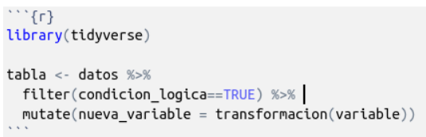
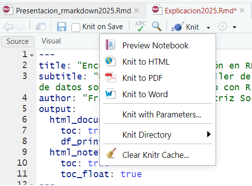
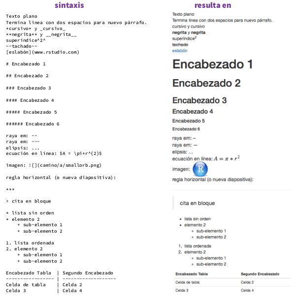

Material adaptado del trabajo realizado por Pablo Tiscornia

### R Markdown: Introducción

Los archivos R Markdown nos permiten combinar código, resultados y texto. El objetivo de este encuentro es aprender a trabajar bajo dicho entorno para facilitar tres aplicaciones:

-   Documentar el trabajo que realizamos, incluyendo comentarios sobre los procedimientos.
-   Compartir código y resultados con personas que también trabajan en R.
-   Compartir resultados con personas que NO trabaja en R .

Las presentes notas de clase están basadas en el libro [R4DS](https://es.r4ds.hadley.nz/r-markdown.html) y las [cheatsheets](https://www.rstudio.com/resources/cheatsheets/). También se recomienda el libro [R Markdown: The Definitive Guide](https://bookdown.org/yihui/rmarkdown/).

------------------------------------------------------------------------

### Requisitos

Necesitamos instalar y cargar el paquete **rmarkdown**. Por lo general, no hace falta hacerlo porque RStudio realiza esto automáticamente.

### Markdown básico

Se trata de un archivo de extensión **.Rmd**. Contiene en su estructura tres tipos importantes de contenido:

-   Un encabezado YAML (*"Yet another markup lenguage"*) rodeado de - - -

```         
---
title: "El título de nuestro informe"
date: Febrero 2025
output: html_document
---
```

-   Bloques de código de R rodeado de \`\`\`.



-   Texto con formato

Cuando abrimos un archivo **.Rmd**, obtenemos una interfaz de notebook donde el código y el output se encuentran intercalados (en lugar de aparecer el output sólo en la consola, panel de plots y/o modificaciones en el entorno de trabajo).

Los bloques de código se pueden ejecutar haciendo click en el ícono **ejecutar** (el botón de *Play* en la parte superior/derecha del bloque), o presionando `Cmd/Ctrl + Shift + Enter`. RStudio ejecuta el código y muestra los resultados incustrados en el código.

Para producir un reporte completo que contenga todo el texto, código y resultados, podemos clickear en **Knit** o presionar `Cmd/Ctrl + Shift + K`. Esto mostrará el reporte en el panel *Viewer* y creará un archivo HTML independiente que podremos compartir con otros.

### ¿Qué es "knitear"?

En el contexto de RMarkdown, es el proceso que convierte un archivo .Rmd (R Markdown) en un documento final en formatos como HTML, PDF o Word.

Este proceso es gestionado por el paquete knitr y ejecuta el código R dentro del documento, integrando los resultados en el texto final.

🔹 Para compilar manualmente un archivo .Rmd en RStudio, hacer clic en el botón "Knit" o usar el comando. **"Knit"** significa **"tejer"** el documento combinando texto, código y resultados en un formato legible.



### Formateo de texto

La prosa en los archivos .Rmd está escrita en Markdown, una colección simple de convenciones para dar formato a archivos de texto plano. Markdown está diseñado para ser fácil de leer y fácil de escribir, siendo también muy fácil de aprender. Del *Cheatsheet*:



------------------------------------------------------------------------

### Bloques de código

Como ya mencionamos, para ejecutar código dentro de un documento R Markdown, necesitamos insertar un bloque (*Chunk*). Hay tres maneras para hacerlo:

-   El atajo de teclado `Cmd/Ctrl + Alt + I`
-   El icono “Insertar” en la barra de edición (`Insert > R`)
-   Tipear manualmente los delimitadores de bloque ```` ```{r} ```` y ```` ``` ````.

Obviamente, se recomienda usar el atajo de teclado porque, a largo plazo, ahorra mucho tiempo. El código se puede seguir corriendo con `Cmd/Ctrl + Enter` línea a línea. Sin embargo, los bloques de código tienen otro atajo de teclado: `Cmd/Ctrl + Shift + Enter`, que ejecuta todo el código en el bloque.

Un bloque debería ser relativamente autónomo, y enfocado alrededor de una sola tarea. Las siguientes secciones decriben el encabezado de bloque que consiste en ```` ```{r ````, seguido por un nombre opcional para el bloque, seguido entonces por **opciones separadas por comas**, y concluyendo con `}`. Inmediatamente después sigue tu código de R el bloque y el fin del bloque se indica con un ```` ``` ```` final.

Hay un nombre de bloque que tiene comportamiento especial: `setup`. Cuando nos encontramos en modo notebook, el bloque llamado setup se ejecutará automáticamente una vez, antes de ejecutar cualquier otro código.

### Opciones en los bloques de código

La salida de los bloques puede personalizarse con **options**, argumentos suministrados en el encabezado del bloque. Knitr provee casi 60 opciones para que puedas usar para personalizar tus bloques de código, la lista completa puede verse en <http://yihui.name/knitr/options/>.

Las que más utilizamos nosotros son:

-   `eval = FALSE` evita que código sea evaluado. (Y obviamente si el código no es ejecutado no se generaran resultados). Esto es útil para mostrar códigos de ejemplo, o para deshabilitar un gran bloque de código sin comentar cada línea.

-   `include = FALSE` ejecuta el código, pero no muestra el código o los resultados en el documento final. Usa esto para el código de configuracion que no quieres que abarrote tu reporte.

-   `echo = FALSE` evita que se vea el código, pero no los resultados en el archivo final. Utiliza esto cuando quieres escribir reportes enfocados a personas que no quieren ver el código subyacente de R.

-   `message = FALSE` o `warning = FALSE` evita que aparezcan mensajes o advertencias en el archivo final.

-   `results = 'hide'` oculta el output impreso; `fig.show = 'hide'` oculta gráficos.

-   `error = TRUE` causa que el render continúe incluso si el código devuelve un error. Esto es algo que raramente querés incluir en la version final de tu reporte.

Contamos con algunas de estas opciones en el menú de **Configuración** en la parte superior-derecha del *Chunk* de código.

### Formatos

Hasta ahora vimos R Markdown para producir documentos HTML:

```         
---
title: "Clase"  
output: html_document
---
```

Para sobrescribir los parámetros predeterminados se necesita usar un campo de output extendido. Por ejemplo, si queremos generar un `html_document` con una tabla de contenido flotante, usamos:

```         
---
title: "Clase"
output:
  html_document:
    toc: true
    toc_float: true
---
```

Para los `html_document` otra opción es hacer que los fragmentos de código estén escondidos por defecto, pero visibles con un *click*:

```         
---
title: "Clase"
output:
  html_document:
    code_folding: hide
---
```

### Otros formatos

Hay todo un número de variaciones básicas para generar diferentes tipos de documentos:

-   `pdf_document` crea un PDF con LaTeX (un sistema de código abierto de composición de textos), que necesitarás instalar. RStudio te notificará si no lo tienes.

-   `word_document` para documentos de Microsoft Word (.docx).

-   `odt_document` para documentos de texto OpenDocument (.odt).

y más!

### Notebooks

Un notebook, `html_notebook` ("cuaderno" en español), es una variación de un `html_document`. Las salidas de los dos documentos son muy similares, pero tienen propósitos distintos. Un `html_document` está enfocado en la comunicación con los encargados de la toma de decisiones, mientras que un notebook está enfocado en colaborar con otros científicos de datos. Estos propósitos diferentes llevan a usar la salida HTML de diferentes maneras. Ambas salidas HTML contendrán la salida renderizada, pero **el notebook también contendrá el código fuente completo**. Esto significa que podemos usar el archivo `.nb.html` generado por el notebook de dos maneras:

-   Podemos verlo en un navegador web, y ver la salida generada. A diferencia del `html_document`, esta renderización siempre incluye una copia incrustada del código fuente que lo generó.

-   Podemos editarlo en RStudio. Cuando abramos un archivo `.nb.html`, RStudio automáticamente recreará el archivo `.Rmd` que lo creó.

### Publicar

Desde RStudio tenemos la posibilidad de publicar nuestros Markdown en [RPubs](https://rpubs.com/) de forma gratuita, desde el botón **Publish document**. Todo lo que subamos a nuestra cuenta de RPubs será público.

------------------------------------------------------------------------

# Práctica

1)  Crear un informe que contenga:

-   **En TEXTO:**
    -   Una estructura mínima de texto (Título, consigna, descripción de las tareas realizadas y muy breve conclusión)
-   **En CÓDIGO:**
    -   Carga de librerías (no mostrar el código en el reporte)
    -   Importación de datos (mostrar el código en el reporte)
    -   Algún procesamiento mínimo como filtrar, seleccionar, generar un tabulado, etc. (mostrar el código y el resultado en el reporte)
-   *Extra*: Incluir un gráfico
